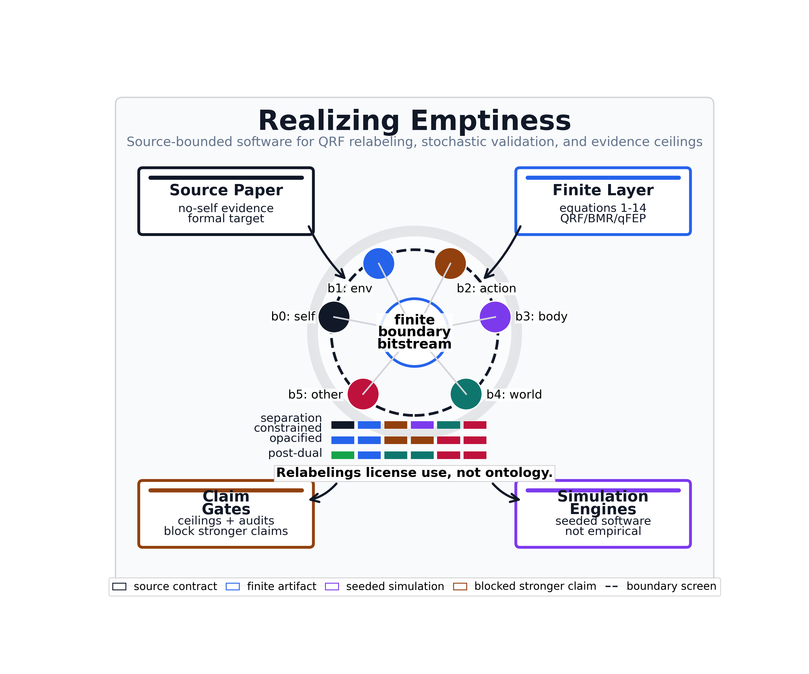

# Abstract {#sec:abstract}

```{=html}
<figure class="graphical-abstract"></figure>
```

This project operationalizes the 2026 preprint *There is no self-evidence: A physics of emptiness realisation* as a source-anchored software artifact [@sandvedsmith2026noself]. Its central claim is that a finite agent can use a boundary for prediction while never obtaining evidence that the boundary is ontologically real, and the software separates three local artifact roles: formal sanity checks for source equations, positive-control-style finite mechanism checks, and discriminating tests that reject stronger readings when a control is perturbed. The formal layer maps the paper's quantum free-energy principle (qFEP) and quantum reference frame (QRF) equations into finite operational surrogates, bridging each paper equation to a specific software artifact. The computed artifacts are a suite of finite quantum-information and contextuality audits — spanning two-qubit separability and entanglement entropy, Bell and contextuality witnesses, thermodynamic and open-system dynamics, seeded quantum-trajectory sampling checked against exact solutions, and frame-covariance checks for the quantum reference frame relabelings — with explicit positive controls, negative controls, or boundary checks recorded where the corresponding artifact contract requires them. The software represents QRF deployments as policies over boundary-channel sectorisations, using the same finite bitstream under self/environment/contextual relabelings so that QRF labels can organize prediction, action selection, and transformation covariance while failing to become evidence for an ontological self/world boundary. Bayesian model reduction is implemented as a sweep over prior precision and metacognitive access, extended with a sensitivity grid over observation noise. The separation prior is pruned only when removing it lowers the model's free energy, and kept when its remaining contribution to accuracy still offsets its complexity cost. The active-inference layer uses the inferactively-pymdp library [@heins2022pymdp] with profile-specific likelihood, transition, preference, and prior arrays for the separation-constrained, opacified, and post-dual quantum reference frame deployments, then records posterior beliefs, policy posteriors, selected actions, expected-free-energy summaries, seeded stochastic ensembles with null controls and replay seeds, and confidence intervals, without treating those simulations as empirical subject data. Practice protocols, compassion-policy scope, criticality-style indicators, quantum-boundary dynamics, empirical adapters, and artifact-release readiness are therefore written as bounded model interfaces, simulated indicators, local private release-readiness records, or blocked evidence classes. A physical realization of the quantum free-energy principle, public independent reproduction, and any human practice efficacy, neural measurement, or clinical outcome remain blocked future evidence classes.


```{=latex}
\newpage
```


# Introduction {#sec:introduction}

## No-Self-Evidence as a Finite Boundary-Screen Problem {#sec:introduction-paper-source}
Sandved-Smith et al. [@sandvedsmith2026noself] argue that a finite agent can self-evidence through its generative model while never obtaining evidence for the ontological reality of its own boundary. This no-self-evidence problem is the formal target operationalized here. The software turns the argument into an executable boundary discipline by holding three operations apart that prose usually runs together: using a boundary channel for prediction, labeling that channel with a quantum reference frame (QRF) sector, and treating the label as though it had ontological support. The first operation is licensed, the second is a model-indexing choice, and the third is the move the bitstream cannot underwrite.

A quantum reference frame (QRF), as used here, is a frame-dependent sector labeling over the same finite boundary bitstream. It is a bookkeeping choice that says how a model reads the screen, not a claim that the software has implemented a physical quantum reference frame or discovered a physical observer boundary. Physical QRF work concerns transformations between quantum reference systems; this manuscript uses that literature only as a boundary for what the finite relabeling surrogate is not claiming [@giacomini2019qrf; @vanrietvelde2020perspective; @bartlett2007reference]. The finite boundary screen is written as `B = {b0, b1, b2, b3, b4, b5}`. Each `b_i` is a software observation channel that can carry a bitstream, not a discovered biological sensor, physical boundary qubit, or ontological sector.

Three terms therefore need to be read in the narrow model-theoretic sense used throughout the manuscript. Agency means action-contingency inside the finite model: selected actions make some boundary channels easier to predict by lowering prediction error under the declared generative model. Care means the `b5` care-salience cue and the later policy-scope proxy input; it is not moral compassion, a validated affective measure, or evidence of contemplative concern. The three modes are QRF deployments, not psychological stages or realized states: `separation_constrained`, `opacified`, and `post_dual`. What changes across them is the sector label assigned to each channel, the metacognitive-access parameter, the separation-prior precision, the generative-model priors and preferences, and therefore the frequencies of selected actions. What does not change is the evidenced object: the same observed b0-b5 bitstream remains the boundary data each deployment has to organize.

The six-channel screen is the smallest current surrogate that can carry the six distinct interface cues needed by the three profile relabelings: `b0` is a body-controllability cue, `b1` an action-contingency cue, `b2` a distal-world cue, `b3` a contextual-world cue, `b4` an other-agent cue, and `b5` a care-salience cue. These six cues make the model readable while keeping the evidenced object fixed: the bit carried by each channel. They are not six ontological sectors, and their names add no evidence that any channel belongs to a real self, a real environment, or a real interpersonal field.

The sector labels are deliberately operational. Self marks channels treated as belonging to the modeled agent under a given QRF deployment. Action marks a channel whose changes are conditioned by selected policy. Body marks controllability without making a biological-body claim. Environment or env marks the residual non-self field in the dual profile. World marks contextual non-self structure after the self/environment cut is no longer privileged. Other marks a non-self agent-like cue. Care marks a salience cue used by the bounded compassion-scope proxy. Each label is a model-indexing variable: it changes how the finite model organizes prediction, not what the bitstream proves about reality.

The figures use the same restricted vocabulary. An analytical/a-priori map defines a permission, label space, or equation binding. A deterministic finite audit reports a fixed software computation with controls. A pymdp profile simulation is reserved for the later active-inference `A`, `B`, `C`, and `D` arrays, policy traces, and posterior summaries. A seeded stochastic robustness figure adds replayable sampling, null controls, or intervals around a finite simulator. A governance/practice boundary artifact audits claims, sources, protocols, or validation without adding outcome evidence. These roles are method labels, not evidence-class upgrades.

The central QRF move is to partition the same six channels in more than one way. As laid out in @fig:qrf_sector_situation, the separation-constrained profile sends `b0,b1,b5 -> self` and `b2,b3,b4 -> env`, so sigma imposes a dual self/environment reading on the screen. The opacified profile sends `b0 -> self`, `b1 -> action`, `b2,b3 -> env`, `b4 -> other`, and `b5 -> care`, so some channels stay dual while others become inspectable as action, other, and care labels. The post-dual profile sends `b0 -> body`, `b1 -> action`, `b2,b3 -> world`, `b4 -> other`, and `b5 -> care`, organizing the same bitstream with no privileged self/environment cut. These are three carvings of one interface, not three competing measurements of what the interface ultimately is.

![The QRF sector situation for early reading, showing one shared boundary screen of channels b0-b5 read through three sector lenses. A top row of cells carries the evidenced observation symbols, dotted vertical lines tie each bit to the separation-constrained, opacified, and post-dual lens rows below, a legend maps each lens color to a sector label, and a per-lens sector count records how finely each lens carves the screen, so the figure shows that the partitioning changes while the evidenced bitstream and its claim boundary stay finite software surrogates rather than empirical, neural, ontological, or physical qFEP evidence.](../figures/qrf_sector_situation.png){#fig:qrf_sector_situation width=98%}

The same six channels are shown geometrically in @fig:qrf_boundary_screen_geometry before the results section audits their behavior. The figure should be read as the object the rest of the manuscript manipulates: action enters a finite boundary screen, observations leave it as b0-b5 bits, and the surrounding role labels make the software channels legible without turning them into empirical sensors or ontological parts.

{#fig:qrf_boundary_screen_geometry width=98%}

That distinction is the whole argument, and @fig:boundary_use_vs_ontology states it as a permission rule. A partition changes the model's organization: which priors are admissible, which transitions count as action-contingent, which observations are preferred, and which policies become cheap or costly under expected free energy. So a frame is unambiguously useful. But if two admissible partitions are defined over the same bitstream, the bitstream cannot by itself certify an ontological self/world boundary or decide which partition is real. Boundary use and boundary ontology are different evidential objects: the project therefore treats QRF sector labels as model-indexing variables and treats Bayesian model reduction as a comparison over useful priors, not as a metaphysical removal of a self.

![Boundary use versus boundary ontology rendered as a stepwise permission diagram for the no-self-evidence claim. Step 1 shows the shared finite b0-b5 bitstream as the only evidenced object; Step 2 licenses reading those same bits through admissible QRF sector labels for prediction, policy selection, and model comparison when the equal-distribution audit passes; Step 3 blocks treating any chosen sector frame as a real self/world boundary because the perturbation control fails. Color encodes the licensed and blocked lanes, while the legend names the two verdicts, keeping the figure a finite software audit and not empirical, neural, clinical, practice-efficacy, or physical qFEP evidence.](../figures/boundary_use_vs_ontology.png){#fig:boundary_use_vs_ontology width=98%}

The manuscript therefore reads the paper as a formal specification for finite tests rather than as a vocabulary to be illustrated. Source provenance anchors what is being recapitulated, the equation registry records which expressions are computable surrogates, and the simulation layer asks how separation priors, QRF relabelings, Bayesian model reduction, replayed active-inference traces, seeded stochastic ensembles, and finite open-system quantum surrogates behave under explicit arrays. The finite QRF boundary screen is defined in @sec:methods-finite-qrf-boundary-screen, its lead audits appear in @sec:results-qrf-boundary-geometry, and the implemented finite quantum extension engines that extend it without changing the evidence class are defined in @sec:methods-roadmap-quantum-engines.

This framing also fixes the role of scholarship. Active-inference and Markov-blanket sources make the generative-model and boundary vocabulary precise, including the critique and response literature that warns against unqualified moves from sparse coupling or FEP formalisms to real-world boundary ontology [@friston2023fep_simpler; @aguilera2021particular; @biehl2021technical_fep; @heins2022sparse_coupling]. Quantum-information, QRF, contextuality, and quantum-trajectory sources make the finite simulations mathematically legible; contemplative and Buddhist sources constrain terminology at the interface to practice. None of those source roles is allowed to substitute for the missing evidence class that would be required to claim realization, clinical benefit, neural measurement, or physical quantum free-energy principle (qFEP) confirmation.

The mapping from the source paper to this software is a recapitulation scope rather than a reproduction of the physics. The paper's qFEP section and its equations 1-6 map to the equation registry and the finite quantum and contextuality engines; the no-self-evidence section maps to the QRF boundary-screen indistinguishability audit; the separation-to-emptiness section maps to the separation prior sigma and the Bayesian model reduction sweep; the post-dual agent section maps to the post-dual `pymdp` profile and the finite solution-set containment over equations 13 and 14; and the discussion themes of contextuality, compassion, and criticality map to the finite contextuality engines, the policy-scope-of-concern surrogate, and the measured branching and avalanche signatures. Each mapped row is a finite software surrogate with a declared evidence ceiling, never a claim that the underlying physical or contemplative phenomenon has been realized. A generated row-by-row map from paper equations 1-14 to artifacts and gates is maintained in the equation crosswalk reference document.

## Finite Surrogates over Literal Quantum Simulation {#sec:introduction-limitations}
The implementation does not attempt a literal quantum simulation of the universe-agent boundary. Instead, it builds finite surrogates that preserve the paper's inferential roles: boundary screens, QRF deployments, separation priors, model reduction, and post-dual policy flexibility. This lets the software clarify the evidential boundary without strengthening it: a useful simulated partition is still not evidence for a real self/world partition.


```{=latex}
\newpage
```


# Methods {#sec:methods}

The methods build the finite chain in dependency order: an equation registry and implemented finite quantum extension engines fix the formal layer and its claim ceilings, the finite QRF boundary screen and its relabeling semantics define the core object, the separation prior and its Bayesian model reduction sweep give the self/environment cut its life-cycle, and the profile-specific pymdp generative models instantiate the three QRF deployments as finite arrays and traces. Figures are read through five method roles. Analytical/a-priori maps define admissible labels, equations, claim boundaries, or reader permissions. Deterministic finite audits report fixed-grid, fixed-seed, or linear-algebra computations with explicit controls. pymdp profile simulations use the pinned active-inference runtime surface and local `A`, `B`, `C`, and `D` arrays to replay profile traces. Seeded stochastic robustness figures expose replayable ensembles, bootstrap/permutation summaries, or trajectory convergence checks. Governance/practice boundary artifacts document sources, claims, protocols, validation, or release limits without adding evidence of efficacy. The source-role scholarship, claim-evidence ceilings, seeded criticality and compassion-scope proxies, and bounded practice protocols that govern and extend this chain are collected in the supplement so the main methods stay on the no-self-evidence spine.

## Equation Registry and Finite qFEP Engines {#sec:methods-roadmap-quantum-engines}
Every symbol introduced in this subsection — the sectorisation map, the boundary screen, the separation prior, the free-energy terms, and the finite quantum quantities — is defined, with its natural-language name and a short description, in the symbol and variable glossary (@sec:supplement-symbol-glossary). Readers meeting a symbol for the first time should treat that glossary as the canonical reference; the prose here introduces each symbol only where it is first used.

The equation registry covers paper equations 1-14. Each row records the paper section, formal expression, computability status, operational status, paper-to-software bridge, validation artifact, and interpretive boundary. The registry therefore treats the source paper as a formal specification rather than as a set of slogans to be reproduced in code. The operational status map is retained as supplemental governance material so the first numbered result can present the finite QRF boundary model directly.

For stable internal reference, the registry file records all fourteen source equations, while the manuscript anchors the QRF rows used repeatedly by the boundary-channel argument. The sectorisation map $Q$ sends boundary states $B$ to sector labels $S_Q$:

$$
Q: B \rightarrow S_Q
$$ {#eq:7}

The frame-restricted model $M_Q$ reproduces the coarse-grained observation likelihood of the full model under that sectorisation:

$$
P(\bar{o} \mid M_Q) = P(\bar{o} \mid Q, M)
$$ {#eq:8}

Two sectors $Q_i$ and $Q_j$ are indistinguishable when they induce the same observation distribution:

$$
P(o \mid Q_i) = P(o \mid Q_j)
$$ {#eq:9}

The separation prior $\sigma$ restricts admissible sectorisations to a subspace $Q_{\sigma}$:

$$
\sigma: Q \rightarrow Q_{\sigma} \subset Q
$$ {#eq:10}

These anchors are manuscript reference targets for the finite registry, not a replacement for the source paper's formal derivations.

The resulting formal layer has three kinds of rows. First, computable active-inference rows become finite surrogates over boundary channels, QRF sector labels, profile-conditioned scores, separation-prior admissibility, and free-energy comparisons. The free-energy rows include a worked complexity decomposition for registry equation 6, a Kullback-Leibler complexity surrogate for registry equation 11, and a solution-set containment audit for registry equations 13 and 14 whose discriminating negative control is a strict-superset witness.

Second, quantum-information rows that can be represented faithfully in a small Hilbert space are simulated directly as finite controls. Each engine records a primary quantity together with a positive control and a discriminating negative control; the full per-engine construction, controls, and claim boundary live in @sec:supplement-finite-quantum-contextuality-audits, and the entries below name each engine and forward to that audit:

- a Schmidt-family two-qubit sweep recording reduced von Neumann entropy, mutual information, Clauser-Horne-Shimony-Holt (CHSH) witness strength, contextual-fraction scaling, local-basis entropy invariance, and a Landauer-scaled erasure lower bound;
- a mixed-state audit adding positive-partial-transpose (PPT) and negativity controls for separable, Bell, and Werner-family cases [@peres1996separability; @horodecki1996separability; @werner1989quantum], extended by a multipartite witness suite over three-party cuts [@greenberger1989going];
- a CHSH measurement-cover table recording context-by-outcome joint probabilities, no-signaling marginals, product-control locality, Tsirelson-bound saturation [@cirelson1980quantum], and local-hidden-variable polytope feasibility over the sixteen deterministic assignments following the joint-probability/local-polytope reading of Bell inequalities [@fine1982hidden], with a general measurement-cover parser and a no-signaling scenario library repeating the linear-program (LP) test for triangle, parity, CHSH-product, CHSH-Bell, and n-cycle scenarios [@araujo2013ncycle];
- finite completely-positive trace-preserving (CPTP) channels recording entropy-change and Landauer lower-bound summaries [@kraus1983states; @nielsen2010quantum], a finite dephasing channel recording trace preservation, positivity, entropy production, mutual-information contraction, and CHSH decay, and a collision-model thermalisation engine recording relaxation toward a fixed point.

Third, the implemented extension methods are finite software engines, again with their full construction and controls in @sec:supplement-finite-quantum-contextuality-audits:

- a two-qubit boundary-Hamiltonian Lindblad audit following Gorini-Kossakowski-Sudarshan-Lindblad (GKSL) trace and positivity constraints [@gorini1976completelypositive; @lindblad1976generators; @manzano2020lindblad];
- seeded quantum-trajectory unraveling that samples jump and no-jump Monte Carlo wave functions and compares the ensemble density with exact Lindblad evolution using the Monte Carlo wave-function literature as the methodological anchor [@dalibard1992wavefunction; @molmer1993montecarlo; @plenio1998quantumjump; @wiseman2010quantum];
- exact and sparse boundary-screen sweeps that test cut sensitivity as many-body precursors to tensor-network scaling, with a matrix-product-state tensor-network benchmark recording entanglement-bounded compression error [@eisert2010area; @orus2014tensor];
- an internal-cut unmeasurability audit and a contextuality-suppression audit that operationalise the source paper's internal-boundary and contextuality-suppression sections;
- sheaf and measurement-cover LP audits that distinguish noncontextual global sections from obstruction cases [@kochen1967problem; @abramsky2011sheaf];
- QRF covariance audits that test probability-preserving relabelings and finite unitary and permutation frame transforms [@giacomini2019qrf; @vanrietvelde2020perspective; @hoehn2021trinity; @bartlett2007reference];
- an empirical adapter provenance audit that requires source identity, preprocessing, null models, and preregistration-oriented governance before any human claim [@wilkinson2016fair; @nosek2018preregistration].

This structure makes `qfep_surrogate_scope` narrower and more useful. The claims `quantum_separability_entropy`, `quantum_contextuality_witness`, `quantum_measurement_contextuality`, and `quantum_open_system_dephasing` are allowed because they point to audited finite quantum artifacts and pass negative controls. The additional implemented extension artifacts add stronger software validation and more adversarial failure cases, but the prohibited inference remains explicit: none of these finite engines is physical qFEP realization, empirical practice evidence, neural measurement, or evidence for contemplative attainment.

## Finite QRF Boundary Screen and Relabeling Rules {#sec:methods-finite-qrf-boundary-screen}
QRF deployments are represented as assignments from boundary channels to semantic sectors. A deployment contains a sector label per boundary bit, a metacognitive-access parameter, and a separation-prior precision. The separation-constrained profile restricts labels to the dual `self` and `env` sectors; the opacified profile mixes dual and contextual labels; the post-dual profile searches a richer sector vocabulary over body, action, world, other, and care.

The shipped profile table is fixed by `src/simulation/qrf_env.py:default_deployments`:

| profile | b0-b5 sector labels | metacognitive access | separation-prior precision | operational reading | policy consequence |
| --- | --- | ---: | ---: | --- | --- |
| `separation_constrained` | `self,self,env,env,env,self` | `0.0` | `4.0` | dual self/env reading; action-contingency and care-salience remain folded into the self side of sigma | tends to stabilize the dual prior when the action-contingent stream is predictable |
| `opacified` | `self,action,env,env,other,care` | `0.55` | `2.0` | action, other, and care become inspectable while some dual structure remains | makes boundary inspection cheaper without fully releasing the separation prior |
| `post_dual` | `body,action,world,world,other,care` | `1.0` | `0.2` | the self/environment cut is treated as revisable rather than privileged | favors releasing the separation prior when the contextual profile predicts well |

The finite QRF surrogate is intentionally small enough to audit. Six binary boundary channels define the screen, written b0 through b5 in the ledger artifact. Each b_i is a software observation channel that can carry a binary bit; it is not a biological sensor, a physical qubit on an organism, or evidence that a real boundary has been found. The ledger assigns finite surrogate roles to the channels: b0 is a body-controllability cue, b1 an action-contingency cue, b2 a distal-world cue, b3 a contextual-world cue, b4 an other-agent cue, and b5 a care-salience cue. These roles make the simulation readable, but the evidenced object remains the same bit b_i across all QRF deployments.

Equations @eq:7, @eq:8, @eq:9, and @eq:10 are therefore implemented as an explicit distinction between channel and label. @eq:7 maps the boundary channels into a sectorisation; @eq:8 keeps model evidence conditional on the chosen QRF; @eq:9 blocks the inference from observed bitstream to ontological sector; @eq:10 represents sigma as the prior that restricts admissible QRF deployments to Q_sigma. The b0-b5 ledger records the sector label assigned to every channel under the separation-constrained, opacified, and post-dual profiles, while also recording that the evidence object is invariant. This draws on QRF, perspective-neutral frame, and Markov-blanket boundary scholarship while keeping the software object distinct from either a full quantum reference-frame transformation or an empirical biological boundary; the FEP critique and response literature is cited here precisely to keep that distinction visible [@giacomini2019qrf; @vanrietvelde2020perspective; @kirchhoff2018blankets; @hipolito2021markov; @aguilera2021particular; @biehl2021technical_fep; @heins2022sparse_coupling].

The key QRF test is not whether one label vocabulary sounds philosophically preferable. It is whether admissible relabelings alter the finite boundary bitstream distribution. The boundary-indistinguishability audit therefore holds the observation distribution fixed across admissible sectorisations and includes a perturbation that must fail. This is the software analogue of the paper's claim that boundary use and boundary ontology are not the same evidential object.

The lead QRF figures are generated from the same artifacts rather than drawn as free-standing schematics. The boundary-screen geometry in @fig:qrf_boundary_screen_geometry maps nodes, action edges, observation edges, and channel-role labels to `qrf_boundary_channel_ledger.json`; the relabeling ledger in @fig:qrf_channel_relabeling_ledger maps b0-b5 channel rows and profile-specific sector colors to the same ledger and equations @eq:7, @eq:8, @eq:9, and @eq:10; the invariance and policy-flow audit in @fig:qrf_invariance_policy_flow maps admissible probability bars, the failing perturbation control, and selected action counts to `qrf_boundary_indistinguishability.json` and the profile-specific active-inference comparison. The transformation-covariance audits reported in @sec:supplement-finite-quantum-contextuality-audits extend this same discipline to finite probability-preserving relabelings: admissible maps must preserve mass and expectation under relabeling, while mass-gain and negative-entry controls must fail.

## Separation Prior as a Restricted QRF Subspace {#sec:methods-separation-prior-subspace}
The separation prior is represented as a structural precision over the admissible QRF subspace. A high-precision prior restricts sectorisations to self/environment labels; an opacified prior becomes inspectable; a post-dual profile optimizes over the full deployment set.

The model treats the prior as useful before it is treated as dispensable. At low metacognitive access, the dual partition can still buy accuracy by stabilizing prediction over a limited boundary screen. At higher access, the same prior carries complexity cost while contributing less accuracy. This is why the software compares full and reduced models rather than assuming that the separation prior should always be removed.

The emergence half of this life-cycle is operationalized separately from the Bayesian model reduction pruning. Section 4.1 of the source argues that a factored self/environment model outperforms an unfactored alternative at predicting the consequences of the agent's own actions precisely when boundary channels are action-contingent. The emergence audit constructs a finite boundary stream in which a controllable fraction of channels become deterministic functions of the selected action, then compares a factored predictor that action-conditions the self channels against an unfactored predictor that ignores the split. This emergence audit is a positive-control-style correctness check rather than a falsifiable test: the action-contingent channels are built as deterministic functions of the selected action, so a predictor that action-conditions them necessarily recovers them and the advantage's rise with empowerment is expected by construction. The zero-empowerment row is correspondingly an identity baseline, not a discriminating control: with an empty self/environment split the factored and unfactored predictors reduce to the same computation, so their advantage is necessarily zero there. The audit's genuine content is a check that the advantage stays at zero when no channel is action-contingent and tracks the number of action-contingent channels, which would break only if the predictors were mis-specified; it is not an adversarial null against the separation-prior mechanism. The measured emergence and life-cycle figures are reported in @sec:results-bmr-sensitivity, where they can be read as results rather than as method definitions.

The dispensable end of the life-cycle is operationalized by a separate ongoing-revision audit, following Sections 5.2 and 5.3 of the source. It constructs a non-stationary boundary stream whose useful sectorisation flips at a midpoint regime change, then compares a rigid agent locked to one sectorisation against a post-dual agent that re-selects the sectorisation by measured accuracy each window, action-conditioning a channel only when doing so materially lowers its error. The discriminating negative control is a stationary stream run with identical machinery: the revising agent's advantage jumps at the regime change on the non-stationary stream but records no such jump when the stream does not change, which attributes the gain to revision under change rather than to generic adaptive overfitting. The measured revision dynamics are reported in @sec:results-bmr-sensitivity and interpreted in @sec:discussion-no-self-evidence-boundary; this is a finite toy non-stationary stream and not a claim of realized awakening, impermanence insight, or a zero-person perspective.

Emergence and pruning together trace the source paper's full account of the separation prior as useful when agency is present, habitually reinforced, and later dispensable. Reading the Bayesian model reduction sweep as the prior's net value, the free-energy change when the prior is removed, against metacognitive access records a useful-to-dispensable arc for the weakest admissible prior precision. Stronger priors over-commit and are pruned throughout, so the life-cycle finding must be reported as an in-model result rather than as a guaranteed monotone story, and it carries no developmental, neural, contemplative, or clinical reading.

## Bayesian Model Reduction over the Separation Prior {#sec:methods-bmr-separation-prior}
The Bayesian model reduction (BMR) sweep implements the paper's free-energy comparison as Delta free energy equals Delta complexity minus Delta accuracy [@friston2018bmr]. Removal is favored when metacognitive access makes the separation prior's accuracy contribution dispensable while the complexity cost remains.

The expanded simulation layer adds a sensitivity grid over observation noise, prior precision, and metacognitive access. This grid asks whether the qualitative reduction result survives a broader deterministic parameter surface. A companion alternative-prior audit follows Bayesian workflow and simulation-checking practice by comparing the baseline prior family with a log-compressed sigma-complexity penalty and a convex access-dependent sigma-accuracy bonus [@talts2018sbc; @gelman2020bayesianworkflow]. It does not transform the surrogate into empirical evidence; it makes the model's local assumptions inspectable and gives future work a place to attach richer agents, empirical adapters, or externally reviewed priors.

## Profile-Specific pymdp Generative Models {#sec:methods-pymdp-generative-models}
The `pymdp` simulation is checked in four linked layers [@heins2022pymdp; @dacosta2020discrete]. First, a pinned-runtime dependency check verifies `inferactively-pymdp==1.0.3`, imports the JAX-first `Agent` and `utils` surface, constructs a small agent, runs state inference, and confirms policy-posterior normalization. Second, the generative-model audit gives each QRF profile explicit `A`, `B`, `C`, and `D` arrays, with `A` mapping hidden QRF state to boundary cue, `B` encoding action-conditioned transitions, `C` encoding preferences, and `D` encoding the initial prior. Third, the deterministic policy trace and runtime diagnostics log record posterior state beliefs, policy posteriors, expected-free-energy terms, per-step variational free energy, belief and policy-posterior entropies, selected action labels, perturbation flags, model hashes, normalization residuals, replay metadata, and row-level recomputation checks against the saved arrays; the log additionally binds its manual temporal-prior step to the library's own `update_empirical_prior` so the numpy-transparent shortcut cannot diverge from the `pymdp` convention, and every diagnostic control is pinned by an explicit required-key contract so a narrowed control set fails closed rather than passing vacuously. Fourth, the seeded stochastic ensemble samples from the same normalized profile models and compares profile behavior with null controls.

The policy loop then runs multi-step state inference, policy inference, action selection, observation perturbation, expected-free-energy proxy decomposition, and posterior normalization checks. The action vocabulary is deliberately tied to the QRF formalism: `stabilize_dual`, `inspect_boundary`, and `release_prior`. `stabilize_dual` is the action whose transition tensor pulls probability mass back toward the dual separation-constrained state. `inspect_boundary` keeps the opacified state available and permits movement toward either the dual or contextual reading. `release_prior` moves probability toward the contextual/post-dual state, with the strength of that movement controlled by the profile's transition-relaxation parameter. These action labels are finite transition operators, not reports of inner experience.

Profile-specific action differences enter through the `A`, `B`, `C`, and `D` arrays. `A` combines the profile's likelihood confidence with contextual bias from metacognitive access; `B` encodes the three action-conditioned transition tensors and the profile's transition relaxation; `C` stores the profile preference vector over observations; and `D` stores the profile's initial state prior. The same policy loop can therefore select different actions across profiles because their priors, preferences, and transition costs make different policies cheap or costly under expected free energy. This makes expected-free-energy policy selection inspectable in the same register as the BMR comparison, while preserving the fact that the loop ranks finite software deployments rather than ontologies [@friston2015epistemic; @parr2022active]. The loop is a single-step perception-action cycle (policy length one) iterated over time steps with a fixed generative model; multi-step policy planning and parameter learning are intentionally outside the v1 finite surrogate, so the static model is a deliberate design choice rather than an omission.

The runtime dependency check is intentionally limited. It verifies that the expected package version, backend imports, agent construction, state inference, and policy posterior normalization are live in the current environment. The paper-specific comparison remains in local modules so that QRF labels, separation-prior parameters, source-boundary language, and expected-free-energy decomposition can be rederived by the validator rather than hidden inside a black-box runtime call.

The stochastic ensemble uses the same expected-free-energy utility as the deterministic trace. Hidden states, observations, and actions are sampled from the normalized profile-specific `A`, `B`, `C`, and `D` arrays, while null controls replace the policy-conditioned observation and action channels with uniform draws. The generated ensemble uses `128` replayed runs per profile over `48` sampled steps, yielding `36864` profile/null rows for finite robustness checks. Replayable seeds make the ensemble stochastic rather than arbitrary: a fixed seed reproduces run rows exactly, a changed seed changes sampled paths, and posterior normalization is checked at every sampled step. The robustness layer then compares profile rows with null rows using bootstrap intervals [@efron1979bootstrap], permutation contrasts with Holm correction for multiple profile-metric comparisons [@holm1979sequential], and Cliff's-delta dominance effect sizes [@cliff1993dominance]. These statistics quantify finite simulation separation and uncertainty; they do not convert the simulation into human, neural, clinical, practice-efficacy, or physical qFEP evidence.


```{=latex}
\newpage
```


# Results {#sec:results}

The results follow the no-self-evidence chain: the QRF boundary geometry and indistinguishability audit show, within the finite ledger, that the same bitstream supports several admissible sector frames; a finite quantum scope summary places the implemented extension engines; the Bayesian model reduction pruning and sensitivity behavior trace the separation prior from useful to dispensable; and the pymdp policy traces implement the profiles as finite generative-model runs. The claim-context, criticality, compassion, scholarship, and visualization governance surfaces that keep every finite output below its evidence ceiling are reported in the supplement rather than in the main result sequence.

## Boundary Geometry and QRF Indistinguishability {#sec:results-qrf-boundary-geometry}
The boundary result is now separated into a reader-facing screen definition and two linked result figures so that the same object is not compressed into one panel. The geometric object is introduced in @fig:qrf_boundary_screen_geometry: b0-b5 are software observation channels on a finite boundary screen, action enters the screen, and observation leaves it. The result here is what that screen permits after it has been defined: the relabeling ledger and policy-flow audit show how QRF sector labels organize the same bits without turning nodes, labels, or edges into biological sensors, physical quantum-reference-frame systems, or discovered ontological sectors [@giacomini2019qrf; @vanrietvelde2020perspective].

The second step is the paper's no-self-evidence point in ledger form. @fig:qrf_channel_relabeling_ledger keeps the evidenced row fixed as `b_i same bit`, then displays how the separation-constrained, opacified, and post-dual profiles relabel those same channels into self, env, action, body, world, other, and care sectors. The matrix is intentionally text-labeled as well as colored: the same bitstream can support different QRF partitions, so the partition organizes the model without becoming evidence for the partition's ontology.

{#fig:qrf_channel_relabeling_ledger width=90%}

The third step checks that the relabeling discipline is operational rather than merely diagrammatic. @fig:qrf_invariance_policy_flow shows that all admissible deployments preserve normalized boundary probability mass while the perturbation control fails, then shows that profile-specific policy selection still acts through the same audited screen. The right panel therefore reports model organization and action selection under different QRF profiles; it does not upgrade the sector labels into empirical entities.

{#fig:qrf_invariance_policy_flow width=90%}

The same indistinguishability shown here is what licenses frame use without an ontological verdict (@fig:boundary_use_vs_ontology), and that license is precisely what lets the separation prior be judged on agency rather than on truth in @sec:methods-separation-prior-subspace.

## Finite Quantum Scope and Blocked Claims {#sec:results-finite-quantum-scope}
The finite quantum layer defined in @sec:methods-roadmap-quantum-engines appears in the main Results only as a scope summary. The source paper's central software target remains the no-self-evidence chain: b0-b5 carry observations, QRF deployments relabel the same channels, sigma restricts admissible deployments, and BMR compares the cost of keeping that restriction. @fig:finite_quantum_scope_summary shows which quantum and contextuality engines support that chain and which stronger readings stay blocked as physical qFEP realization, empirical observer-boundary measurement, neural evidence, clinical evidence, or practice-efficacy evidence.

{#fig:finite_quantum_scope_summary width=90%}

The detailed witnesses and controls are therefore reported in @sec:supplement-finite-quantum-contextuality-audits rather than printed as the main result sequence. This placement is substantive rather than cosmetic: it keeps the main paper aligned with @sec:methods-finite-qrf-boundary-screen, @sec:results-qrf-boundary-geometry, and @sec:results-bmr-sensitivity, while preserving the quantum artifacts as inspectable software support for `qfep_surrogate_scope`.

## BMR Pruning and Sensitivity Behavior {#sec:results-bmr-sensitivity}
The BMR sweep records that pruning is not asserted globally. It appears when metacognitive access is high enough that the separation prior no longer pays for its complexity with additional accuracy. The decomposition panel makes this visible as a changing relation among Delta complexity, Delta accuracy, and Delta free energy, while @fig:bmr_pruning_phase_diagram exposes the sign convention across the parameter grid: the free-energy change is the reduced model's free energy minus the full model's, so prune means the reduced model has lower free energy and keep means the separation prior's accuracy contribution still offsets its complexity cost.

The sensitivity grid extends the result over observation noise. The current generated run reports `45` BMR cells and `315` sensitivity cells, expanding the finite denominator for the same keep/prune question rather than changing the evidence class. Across this finite surface, high-access rows prune more consistently than low-access rows, but the analysis remains bounded to deterministic surrogate behavior. The useful result is not a universal conclusion about subjects or practices. It is a parameterized prediction about when the modeled separation prior should become less attractive under the local free-energy decomposition.

Read as the separation prior's life-cycle, these sweeps yield concrete measured values. Across the emergence grid the factored-model advantage rises from 0.0 at zero empowerment, where empowerment is used as a bounded information-theoretic control surrogate [@klyubin2005empowerment], to 0.453 at full empowerment (@fig:separation_prior_emergence), and the weakest admissible prior (precision 0.2) crosses from keep to prune at a metacognitive-access value of approximately 0.56, linearly interpolated between sweep grid points (@fig:separation_prior_net_value), while the stronger priors prune throughout. At the dispensable end, the ongoing-revision audit measures a post-regime advantage jump of +0.21 on the non-stationary stream against -0.02 on a stationary control run with identical machinery, which attributes the gain to revision under change rather than to generic adaptive overfitting. These are single fixed-seed deterministic surrogate values, not developmental, neural, contemplative, or clinical measurements.

![Separation-prior emergence across the empowerment grid. Lines encode the measured factored (self/env) and unfactored model prediction error and their dashed advantage curve as the fraction of action-contingent channels rises; the factored model buys accuracy only when agency is present, and the advantage's rise with empowerment is expected by construction, making this a correctness check rather than a discriminating null. It is a finite deterministic predictor comparison and not a developmental, neural, or empirical empowerment claim.](../figures/separation_prior_emergence.png){#fig:separation_prior_emergence width=90%}

![Life-cycle of the separation prior's net value, the change in free energy when the prior is removed, against metacognitive access, drawn as one line per prior precision rather than a mean. The bolded arc is the precision whose net value actually crosses keep to prune (the weakest admissible precision for the current sweep); it starts positive in the shaded keep region and falls into the shaded prune region as access rises, while the fainter stronger-precision lines stay in the prune region throughout. The dashed marker locates the useful-to-dispensable crossing, and the figure is a finite software sweep, not a developmental, neural, contemplative, or clinical claim.](../figures/separation_prior_net_value.png){#fig:separation_prior_net_value width=90%}

The robustness resampling audit asks the same question cell by cell after aggregating over observation-noise rows. Bootstrap intervals summarize reduced-minus-full free-energy stability and pruning-rate stability for each prior-precision/access pair. This does not make the BMR surface empirical, but it does separate brittle sign changes from cells where the finite surrogate keeps the same keep/prune direction over the sampled noise surface.

The alternative-prior audit adds a second check on the same lifecycle. It repeats the access and prior-precision grid for the baseline, a log-compressed sigma-complexity penalty, and a convex access-dependent sigma-accuracy bonus, then records measured keep/prune verdicts and the weakest-prior crossing for each family. At least one crossing shifts relative to baseline while high-access rows remain numerically bounded, so the result is traceable to explicit prior-family assumptions rather than a single hidden parametrization. This is Bayesian workflow accounting over deterministic software rows [@talts2018sbc; @gelman2020bayesianworkflow], not an empirical power or subject-level inference.

{#fig:bmr_free_energy_decomposition width=90%}

{#fig:bmr_pruning_phase_diagram width=90%}

{#fig:simulation_sensitivity_heatmap width=90%}

{#fig:bmr_robustness_resampling width=90%}

This prune-at-high-access lifecycle (@fig:bmr_pruning_phase_diagram) restates the emergence result (@fig:separation_prior_emergence) as a full life-cycle, useful under restricted access and then reducible with no residual ontological commitment, and is the behavior the active-inference profiles must instantiate in @sec:methods-pymdp-generative-models.

## pymdp Profiles and Policy Trace {#sec:results-pymdp-policy-trace}
The active-inference simulation uses profile-specific `A`, `B`, `C`, and `D` arrays for separation-constrained, opacified, and post-dual QRF deployments. The generative-model audit records normalized likelihood, transition, preference, and prior arrays for each profile; the policy trace records hidden-state posteriors, policy posteriors, expected-free-energy terms, variational free energy, selected actions, perturbation status, and action counts at each step; and the runtime diagnostics log rederives expected-free-energy terms from the saved arrays, verifies weighted expected free energy as `policy_posterior @ expected_free_energy`, checks profile/action/observation labels, records model hashes and package/JAX diagnostics, and checks deterministic replay.

Across the three deployments the post-dual profile minimizes variational free energy at -1.34, below the opacified profile at -0.94 and the separation-constrained profile at -0.80, so it ranks highest under the finite software posterior; this ranking is over finite deployments and is not a claim about which ontology is true.

In @fig:pymdp_profile_comparison, free energy, posterior mass, and selected actions are plotted side by side with short profile labels, a full-name legend, an explicit lower-free-energy sign annotation, and an external action legend. The plotted posterior mass is a software ranking over finite deployments, not a claim about which ontology is true. The posterior trajectory traces how `P(contextual_post_dual state)` evolves under replayed observations and marked perturbation steps; every step is renormalized before it enters @fig:posterior_trajectory. The supplemental runtime dashboard in @fig:pymdp_runtime_validation_dashboard reports the corresponding residuals and replay controls as validation checks for the software surface, not as empirical evidence.

{#fig:pymdp_profile_comparison width=90%}

{#fig:posterior_trajectory width=90%}

These profile comparisons (@fig:pymdp_profile_comparison) close the arc opened by the boundary screen (@sec:methods-finite-qrf-boundary-screen), implementing each licensed sector frame as a distinct finite generative model rather than an asserted interpretation.


```{=latex}
\newpage
```


# Discussion {#sec:discussion}

## What the Software Boundary Establishes {#sec:discussion-no-self-evidence-boundary}
The software preserves the paper's core distinction: a boundary can be useful for prediction without being evidenceable as an ontological division [@dennett1991realpatterns]. In the finite model, this becomes a contrast between using a boundary screen to generate observations and treating the sector labels placed on that screen as if they were themselves evidenced by the bitstream. A boundary channel is therefore an interface variable: it carries observations, supports action-conditioned transitions, and permits posterior updating. A boundary ontology would be a stronger assertion: it would treat the channel's self/world partition as a real division warranted by the evidence. That stronger move is exactly where the FEP and Markov-blanket literature becomes assumption-sensitive rather than automatic [@friston2023fep_simpler; @aguilera2021particular; @biehl2021technical_fep; @heins2022sparse_coupling; @sethbayne2022theories]. The project makes boundary use executable and blocks boundary ontology unless an external evidence class supplies it.

The through-line is boundary use, QRF relabeling, separation-prior emergence, BMR pruning, and post-dual revision. First, the screen supplies a finite interface that can be used for prediction. Second, quantum reference frame (QRF) relabeling records that the same interface can be organized by more than one sector vocabulary. Third, the separation prior becomes useful only when the stream contains agency, because action-contingent channels give the factored model something real to predict. Fourth, Bayesian model reduction (BMR) prunes the prior when access is high enough that the prior's complexity cost no longer pays for itself. Fifth, the post-dual profile treats sectorisation as revisable under changing streams rather than as a final metaphysical conclusion. The point is cumulative: finite success changes model organization, not the evidence class.

The agent acts differently across the three profiles for ordinary active-inference reasons. The observed boundary stream is the same kind of evidence object, but each profile supplies different sector labels, metacognitive access, prior precision, observation preferences, initial state priors, and action-conditioned transition relaxation. Under expected free energy, those arrays make `stabilize_dual`, `inspect_boundary`, and `release_prior` differently costly or attractive. The resulting action-frequency differences are therefore model-internal consequences of the declared `A`, `B`, `C`, and `D` arrays, not behavioral evidence that a subject has moved through psychological, contemplative, or ontological stages.

QRF labels are handled in the same way. The labels self, environment, body, world, action, other, and care are permitted as relabelings of a finite screen, and @fig:qrf_boundary_screen_geometry, @fig:qrf_channel_relabeling_ledger, and @fig:qrf_invariance_policy_flow separate the three required steps: define the screen, relabel the same channels, and verify that admissible relabeling preserves the audited marginal distribution while policy selection changes model organization. That is not a weakness of the implementation. It is the software version of the no-self-evidence point. If the same bitstream supports multiple admissible sectorisations, then the label helps the model organize prediction without becoming evidence for the label's ontology. The QRF literature supports the discipline of frame-dependent description and transformation; in this project it does not erase the difference between a finite relabeling audit and a physical quantum-reference-frame construction [@giacomini2019qrf; @vanrietvelde2020perspective; @bartlett2007reference].

The b0-b5 ledger makes that distinction concrete. In @fig:qrf_channel_relabeling_ledger, b0 through b5 are not six little selves, six physical boundary qubits, or six hidden ontological sectors. They are six software channels that make @eq:7 executable as a map from boundary bits to sector labels. The same b_i can be labeled self/env under sigma, partially opacified into action/other/care labels, or relabeled as body/action/world/other/care in the post-dual profile. @eq:8 says that model evidence is conditional on the QRF choice; @eq:9 says the observed bitstream cannot differentially prove one QRF sectorisation as the real one; @eq:10 says sigma restricts the space of admissible relabelings. The ledger is therefore the visual grammar of the paper's core point: the model may use boundaries, but the boundary's ontological privilege is not among the data.

BMR gives the project a second boundary between use and ontology. A separation prior can remain in the full model when its accuracy contribution offsets its complexity cost, and it can be pruned when removing it lowers the model's free energy. Neither result is a metaphysical verdict. Keep means the local modeled prior is still useful under the finite generative model; prune means the reduced model wins the declared comparison. The caption and cell labels in @fig:bmr_pruning_phase_diagram are intentionally explicit because an ambiguous sign convention would otherwise invite an overclaim about removing the self rather than reporting a model-comparison result.

The separation-prior emergence and net-value figures are therefore not decorative. They are the bridge between the QRF screen and the BMR decision. The emergence grid asks whether a factored self/environment model earns predictive accuracy when action-contingent channels exist; the net-value curve asks when the modeled prior stops paying for itself as metacognitive access increases. Together they clarify what the software establishes is narrower than the vocabulary it makes inspectable. It establishes a local relation among action-contingency, prediction error, and free-energy comparison inside a finite model. Inside that finite software boundary, it does not establish a developmental trajectory, neural event, contemplative attainment, or clinical outcome.

The post-dual agent is modeled as a revising rather than a settled state, following Sections 5.2 and 5.3. The ongoing-revision audit constructs a non-stationary boundary stream whose useful sectorisation flips at a regime change, then compares a rigid agent locked to one sectorisation against a post-dual agent that re-selects the sectorisation by measured accuracy each window. The revising agent's advantage jumps at the regime change, while a stationary stream run with identical machinery records no such jump, which is the discriminating negative control that attributes the gain to revision under change rather than to generic adaptive overfitting. This treats boundary designations as revisable hypotheses, deployed when useful and abandoned when stale. It is a finite toy non-stationary stream modeling revision dynamics, explicitly not a claim of realized awakening, impermanence insight, or a zero-person perspective.

The no-self and emptiness vocabulary is likewise bounded. The software result can be read as a finite analogy to anti-essentialist readings of Madhyamaka: the modeled boundary can be useful while lacking privileged support as an intrinsically real self/world division [@siderits2013middle; @westerhoff2009madhyamaka]. Within this finite evidence boundary, the result is not a claim of Buddhist realization, elimination of all useful self-models, or settlement of phenomenological claims about minimal or prereflective selfhood [@zahavi2005subjectivity_selfhood]. The project therefore treats "no self-evidence" as an evidential boundary inside a finite formalism, not as a global doctrine about consciousness.

The stochastic simulations sharpen this boundary rather than weakening it. Seeded active-inference ensembles sample hidden-state transitions, observations, and actions from normalized profile-specific distributions, and seeded quantum trajectories sample jump/no-jump paths that reconstruct finite Lindblad densities within declared tolerance. The quantum-trajectory sources justify the algorithmic move from master-equation density evolution to sampled wave-function paths; they do not turn the finite two-qubit surrogate into a physical realization of the source paper. These are real stochastic simulations in the software sense: they use replayable random seeds, null controls, confidence intervals, and distributional checks rather than deterministic summaries alone. They are not empirical data. The evidence ceiling therefore stays intact: stochastic variability can test robustness of a formal surrogate, but it cannot establish neural criticality, contemplative realization, clinical benefit, compassion efficacy, or physical qFEP realization.

That distinction is the conceptual hinge of the project. If a separation prior improves prediction under limited access, the model is allowed to use it. If later model comparison favors a reduced prior, the software records that as a free-energy result under specific parameters. If QRF relabelings preserve probability mass, the project records an invariance of the finite screen. If a quantum trajectory ensemble reconstructs a Lindblad density, it records a stochastic finite-system validation. None of these operations licenses the stronger claim that an empirical subject has realized emptiness, that a real observer boundary has been physically found, or that the source paper's full qFEP picture has been confirmed.

## Source Roles Prevent Claim Inflation {#sec:discussion-source-role-boundaries}
Scholarship in this manuscript is source-role aware, claim-ID aware, and evidence-ceiling aware. The project separates primary-target claims from background sources and future empirical context, then audits whether each public claim has scoped support plus an explicit prohibited inference and future evidence requirement. A criticality source can justify a proxy vocabulary, for example, but it cannot certify this simulation as a neural measurement; a contemplative-cognition source can motivate an interface vocabulary, but it cannot certify practice efficacy.

The stronger bibliography changes the argument by sharpening boundaries rather than by inflating claims. Discrete active inference and expected-free-energy sources make the `pymdp` loop technically legible. Markov-blanket sources now include the Pearl-blanket/Friston-blanket critique, so boundary language remains a model-use discipline rather than an ontological shortcut [@bruineberg2022emperor]. Relational quantum mechanics and enactive neurophenomenology add background for observer-relative and enacted-interface vocabulary, but they do not make this six-bit screen a physical QRF or an empirical boundary [@rovelli1996relational; @varela1991embodied]. Self-evidencing and computational-phenomenology sources distinguish organismic inferential function, precision reweighting, and identified-with self language without turning the software profile sequence into a claim about realization, therapy, or practice efficacy [@hohwy2026selfevidencingagent; @tal2026advancedmeditation; @prest2026lettinggo; @prest2026selfingwithoutself]. Quantum-trajectory, QRF-transformation, Fine-style local-polytope, Bayesian workflow, simulation-calibration, and reproducibility-checklist sources make the stochastic, frame-covariance, contextuality, BMR, and local artifact-release layers methodologically inspectable [@fine1982hidden; @talts2018sbc; @gelman2020bayesianworkflow; @pineau2020reproducibility]. None of these moves supplies the missing evidence that would be needed for claims about public independent reproduction, human subjects, practice outcomes, neural regimes, or physical qFEP dynamics.

## Practice Interfaces Remain Outcome-Independent {#sec:discussion-practice-interface-boundaries}
The practice protocol map is useful because it keeps contemplative vocabulary tied to explicit model interventions. It also prevents unsupported slippage from a software run to claims about realization.

This makes the practice layer a design backlog rather than a claim engine. Future interfaces can visualize prior precision, opacification, policy scope, and compassion-proxy fields, but each interface should inherit the same rule: user-facing practice language must remain safety-bounded and outcome-independent unless reviewed evidence and ethics constraints are added. @fig:practice_policy_scope_map renders the three protocols as the bounded model-intervention deltas they actually are, with each protocol's safety boundary printed on the figure, so the practice layer is inspectable as a software interface specification rather than as a set of instructions or efficacy claims.

![Practice protocols rendered as bounded model-intervention deltas. Horizontal bars encode each protocol's metacognitive-access, prior-precision, sector-revisability, compassion-scope, and self-privilege deltas, color encodes increase versus decrease, a dashed line marks no intervention, and each protocol's safety boundary is printed on the figure; these are finite software-interface specifications only and are not therapeutic advice, a claim of realization, a moral prescription, or a clinical protocol.](../figures/practice_policy_scope_map.png){#fig:practice_policy_scope_map width=90%}

## Criticality Remains a Proxy Vocabulary {#sec:discussion-criticality-proxy-boundary}
The criticality proxy track provides a target shape for future empirical adapters: if real data are introduced, the same validator should require source identity, preprocessing provenance, and negative controls. Reporting the measured branching ratio and avalanche-size distribution, rather than a hand-built near-critical score, sharpens that target shape, because a future empirical adapter would compute the same finite signatures over real activity series and compare them against the same shuffled null. Even then, power-law-like avalanche summaries would not by themselves establish criticality, because similar scaling can arise without a critical state and cortical-criticality evidence remains method-sensitive [@touboul2017power_law_absence_criticality; @destexhe2021criticality_evidence]. The branching index is a software-trajectory diagnostic that names what a criticality test would measure; it remains outside the empirical evidence class until reviewed data, preprocessing provenance, and ethics constraints exist [@wilting2019criticality].

## Care and Compassion Stay Normatively Bounded {#sec:discussion-compassion-boundary}
The compassion proxy is deliberately modest. In the model, care first means the `b5` care-salience cue and then the policy-scope input used by the scope-of-concern surrogate. Compassion remains bounded proxy vocabulary, not a psychometric construct, moral achievement, empathic state, prosocial behavior, well-being outcome, or contemplative attainment [@doctor2022care; @strauss2016compassion_measurement; @singer2014empathy_compassion].

The scope-of-concern surrogate makes that boundary inspectable. It measures a finite policy-scope asymmetry from the self partition toward non-self channels by combining separation-prior precision with realised per-channel action influence. The precision-ablation control tests the partition-size-and-precision driver; separate action controls test controllability, no-action collapse, and action-shuffled collapse. The result recovers the source paper's section 6.2 intuition as a scoped model quantity only. It is not a measure of compassion, well-being, affect, or efficacy.

## Evidence Required for Stronger Claims {#sec:discussion-evidence-ceilings}
The evidence-ceiling audit is a deliberate brake on interpretive enthusiasm. A row can be well sourced and still remain narrow: the project therefore records not only support, but also the exact stronger reading that the support does not license. The finite quantum scope summary in @sec:results-finite-quantum-scope and the technical supplement in @sec:supplement-finite-quantum-contextuality-audits can strengthen finite software checks while this section keeps physical, empirical, neural, clinical, and practice-efficacy readings blocked.

The resulting rule for reading the manuscript is simple but strict. Formal recapitulation means the local sentence is anchored to the Sandved-Smith et al. source argument and translated into an executable finite surrogate. Finite software validation means a declared artifact, schema, negative control, and validator agree about a bounded model behavior. Stochastic simulation means replayable seeded trajectories report variability within the simulator, not measurements of brains, practitioners, or physical quantum boundaries. Proxy vocabulary means a concept such as criticality, care, compassion, or practice is being used as a modeled interface or prediction family, not as evidence that an outcome occurred. Technical background is also scoped: even strong FEP, Markov-blanket, or QRF sources can support vocabulary and method shape without turning a finite relabeling screen into a physical or ontological boundary [@aguilera2021particular; @biehl2021technical_fep; @heins2022sparse_coupling]. A blocked evidence class means the project names the future data, physics, ethics, or empirical design that would be required before a stronger claim could be made.

This distinction is especially important for the no-self-evidence thesis. The software can show that changing QRF labels over the same b0-b5 bitstream changes model organization, policy preferences, and BMR pruning decisions under declared priors. It cannot turn that finite success into evidence that no ontological self exists, that a person has realized emptiness, that neural criticality has been measured, or that a practice protocol is efficacious. Those readings are the exact prohibited inferences carried by the claim-context ledger and evidence-ceiling stress matrix.

The manuscript should therefore be read with two simultaneous standards. The first standard is strict: a claim is allowed only when its source role, artifact, schema, negative control, and validator all resolve. The second standard is modest: even an allowed claim stays inside its evidence class. A passing QRF relabeling audit allows the manuscript to say that admissible relabelings preserve the finite bitstream distribution; it does not allow the manuscript to say that a real boundary has been discovered. A passing BMR sweep allows the manuscript to report when a modeled prior is useful or dispensable; it does not allow a claim that the self has been removed. A passing stochastic ensemble allows uncertainty to be reported inside the simulator; it does not make the rows empirical.

This is the manuscript's single future-evidence register. The stronger classes are named here rather than implied elsewhere: physical qFEP realization would require reviewed physical models and thermodynamic accounting; human-subject validation would require sourced data, ethics basis, preprocessing provenance, and preregistered outcomes; clinical, awakening, compassion-efficacy, and neural-measurement claims would require external evidence rather than proxy language; and user-facing practice applications would require human review and safety governance. Until those artifacts exist, the current manuscript's contribution is bounded formal recapitulation and deterministic software validation.

## Finite Engines Do Not Collapse the Evidence Boundary {#sec:discussion-finite-engine-limits}
A finite operational surrogate cannot replace the source paper's quantum-information argument, but it can test selected finite consequences with integrity. The two-qubit layer directly computes separability entropy, CHSH witness strength, measurement-cover probabilities, local-hidden-variable polytope infeasibility, local-basis entropy invariance, Landauer-scaled erasure cost, and dephasing-channel open-system controls. The implemented extension layer also includes boundary-Hamiltonian Lindblad dynamics, exact six-qubit cut sensitivity, a general measurement-cover obstruction LP, finite QRF relabeling covariance, and a fail-closed empirical provenance adapter. Those are real deterministic simulations inside deliberately small state spaces. They still do not instantiate physical qFEP realization, a real many-body observer boundary, full quantum-reference-frame covariance over Hilbert partitions, or an empirical claim about practice.

The expanded simulation grid, richer `pymdp` loop, finite quantum witnesses, and dephasing controls improve internal stress testing but do not change the evidence class. They say more about the local parameter surface, generative-model design, Hilbert-space controls, and policy trace than about any real person, nervous system, practice community, or physical quantum system. That limitation is a feature of the v1 design: it keeps formal recapitulation, software simulation, empirical prediction, and embodied practice interface work in separate registers, with the required stronger evidence consolidated in @sec:discussion-evidence-ceilings.

The robustness audits add a further limit rather than a license for stronger claims. Bootstrap intervals, permutation contrasts, Holm adjustment, and Cliff's-delta effects make stochastic profile/null separation more transparent, but they remain statistics over simulated rows. The same applies to BMR resampling and quantum-trajectory convergence: stable signs and decreasing residuals support the finite software implementation, while unstable cells, wide intervals, or too-few-trajectory failures identify where the surrogate should not be trusted. This is the useful falsification boundary inside the current artifact: a method should be weakened or replaced when its declared negative control passes, when an admissible relabeling changes invariant probability mass, when a reduced model wins only under an unreported sign convention, when stochastic effects vanish against null controls, or when a quantum trajectory ensemble cannot reconstruct the exact density within declared tolerance.

The major limitation is also the reason the manuscript can be useful: it refuses to let conceptual vocabulary outrun evidence. Self, action, body, world, other, and care are expressive labels for finite channels, not measurements of lived experience. QRF is a sector-relabeling discipline here, not a full physical quantum-reference-frame implementation. Compassion scope is a policy-scope proxy, not affect. Criticality is a trajectory diagnostic, not neural criticality. Practice protocols are model-intervention specifications, not instructions or efficacy evidence. These restrictions make the paper less rhetorically expansive, but they make each result inspectable by a reader who wants to know exactly what was computed.

A second limitation is that the current chain is intentionally small. Six boundary channels, three QRF profiles, fixed seeded ensembles, finite Hilbert-space fixtures, and a pinned pymdp runtime make the work reproducible and easy to audit, but they also limit generality. The correct response is not to soften those limits in prose. The required stronger artifacts are named in @sec:discussion-evidence-ceilings; until they exist, the finite engines are best read as a map of what stronger evidence would need to show, not as substitutes for that evidence.


```{=latex}
\newpage
```


# Conclusion {#sec:conclusion}

## What the Finite Surrogates Establish {#sec:conclusion-finite-surrogates-establish}
This project operationalizes the no-self-evidence thesis of Sandved-Smith et al.: a finite agent predicts through a boundary screen of six bits and can read those same bits under several QRF sector frames, yet the bitstream cannot certify which frame is ontologically real. The arc runs from that screen and its frames (@fig:qrf_sector_situation, @fig:qrf_boundary_screen_geometry) to an indistinguishability audit (@fig:boundary_use_vs_ontology) that licenses the frames' use while withholding any ontological verdict, exactly as the surrogate of @eq:9 requires. Under that license a separation prior earns its keep only through agency (@fig:separation_prior_emergence), then sheds it: Bayesian model reduction tracks the prior's net value and prunes the prior at high metacognitive access, at the weakest credible precision (@fig:separation_prior_net_value, @fig:bmr_pruning_phase_diagram). The pymdp active-inference profiles realize the three frames as explicit generative models rather than as asserted interpretations (@fig:pymdp_profile_comparison), closing the loop from screen to policy.

The manuscript's contribution is therefore a disciplined chain rather than a single slogan. It defines the boundary screen, shows how QRF labels can reorganize the same bits, checks that admissible relabelings preserve the finite evidence object, measures when the separation prior becomes predictively useful, tests when Bayesian model reduction makes the prior dispensable, and then replays the profiles through explicit active-inference arrays. Each step is useful because it is narrow. The claim is not that the software proves emptiness, removes a self, or realizes a physical quantum free-energy principle. The claim is that the no-self-evidence argument can be made operational as a set of finite artifacts whose permissions and prohibitions are auditable.

## Validated Finite Software Contributions {#sec:conclusion-validated-contributions}
The result is a source-faithful software foundation for studying no-self-evidence as an operational modeling problem. The project maps the paper's equations into a fourteen-row registry, instantiates finite QRF and BMR surrogates, runs a discrete active-inference loop over explicit profile-specific generative models, samples replayable stochastic ensembles for criticality and policy-scope indicators, tests a suite of implemented finite quantum and QRF extension engines each with positive and discriminating negative controls, and binds every public claim to sources, artifacts, and evidence ceilings. Each contribution is a finite, replayable artifact checked by a fail-closed gate rather than an assertion, which is what makes the foundation auditable rather than rhetorical.

## The Evidence Boundary Left Uncrossed {#sec:conclusion-evidence-boundary}
All of this is finite deterministic software validation against a declared evidence ceiling; none of it is evidence for the ontological, empirical, neural, or contemplative readings of the source paper, and no claim crosses that boundary. The uncrossed boundary is part of the result. It is what prevents a passing relabeling audit from becoming a claim about real selfhood, a passing BMR sweep from becoming a claim about realized non-self, or a seeded stochastic ensemble from becoming a claim about brains, practitioners, or physical observer boundaries.

Four evidence classes remain explicitly outside the current software boundary: a physical realization of the quantum free-energy principle, human-subject validation of the modeled dynamics, clinical or awakening outcomes including compassion efficacy and neural measurement, and the efficacy or safety of any user-facing contemplative practice. The surrogates fix the shape of future tests for these classes; they do not stand in for the tests themselves, and the claim gates are built to fail closed if any artifact is read as if it had; future evidence classes remain explicit work packages rather than implied conclusions.

## Source-Faithful Platform for Future Evidence {#sec:conclusion-source-faithful-platform}
The next defensible direction is not stronger rhetoric but stronger evidence: larger finite simulations with clearer scaling laws, empirical adapters with provenance and ethics constraints, dashboard inspection for claim governance, and reviewed practice interfaces that preserve the same boundary between model use and outcome claims. The project is ready for those directions precisely because its current outputs remain modest, source-role governed, stochastic where sampling is appropriate, and auditable. Read together, the finite surrogates, the validated software contributions, and the uncrossed evidence boundary make this a platform on which those stronger tests can be built without quietly inheriting claims they have not yet earned.

That platform matters because the manuscript now separates three jobs that are often blurred. It recapitulates a source argument in software, validates finite model behavior under negative controls, and names the evidence still missing for stronger claims. A future physical model, human dataset, clinical study, neural measurement, or practice interface can plug into this structure only by adding artifacts and gates that can fail. Until then, the strongest conclusion is deliberately bounded: the software makes no-self-evidence technically inspectable, not empirically settled.


```{=latex}
\newpage
```


# Supplementary Audits and Reproducibility {#sec:supplement}

This supplement collects the load-bearing software audits and governance surfaces kept out of the main argument, grouped so readers can distinguish model behavior from manuscript accountability. It opens with the symbol and variable glossary (@sec:supplement-symbol-glossary). The finite engine audits follow: the quantum and contextuality engines (@sec:supplement-finite-quantum-contextuality-audits), the seeded criticality signatures (@sec:supplement-criticality-indicators), and the compassion policy-scope proxy (@sec:supplement-compassion-scope). The source-role ledger then explains how scholarship is allowed to support vocabulary without raising evidence ceilings (@sec:supplement-source-role-scholarship). The practice-interface material follows, with bounded model interventions (@sec:supplement-bounded-practice-protocols) and an optional contemplative-inquiry reading scaffold (@sec:supplement-contemplative-inquiry). The final section, @sec:supplement-meta-manuscript-record, gathers reproducibility commands, claim and evidence gates, figure source maps, release and review-response ledgers, visual audits, dashboard checks, and supplemental limitations in one meta-manuscript record.

## Symbol and Variable Glossary {#sec:supplement-symbol-glossary}
This glossary is the single structured home for every symbol that appears in the equation registry and in the displayed surrogate equations of @sec:methods-roadmap-quantum-engines. Each row gives the symbol, its natural-language name, and a short description of what it denotes in the finite software surrogate. Where the source paper and the active-inference literature reuse the same letter for two different quantities, the disambiguation note records which reading this project uses. The glossary describes notation only; it does not assert any empirical, neural, clinical, or ontological reading of the quantities it names.

### Boundary screen and quantum reference frames

These symbols appear in the QRF sectorisation and indistinguishability surrogates (@eq:7, @eq:8, @eq:9).

| Symbol | Name | Description |
| --- | --- | --- |
| $B$ | Boundary screen | The finite set of boundary channels (the six bits) through which an agent and its environment interact; the substrate the agent predicts across. |
| $S_Q$ | Sector set | The set of QRF sector labels that a sectorisation can assign to boundary states. |
| $Q$ | Sectorisation map (QRF) | A quantum reference frame realised as a map $Q: B \rightarrow S_Q$ from boundary states to sector labels (@eq:7). |
| $Q_i,\ Q_j$ | Sector labels | Two specific sectors whose observation distributions are compared for indistinguishability (@eq:9). |
| $o$ | Observation | A boundary readout, i.e. a bit pattern emitted by the screen. |
| $\bar{o}$ | Coarse-grained observation | A marginal or aggregated observation used in the frame-relative likelihood (@eq:8). |
| $M$ | Generative model | The agent's full model over boundary dynamics. |
| $M_Q$ | Frame-restricted model | The generative model read under a particular sectorisation $Q$ (@eq:8). |
| $P(\cdot)$ | Probability | A finite probability distribution over boundary outcomes. |

### Separation prior, free energy, and Bayesian model reduction

These symbols appear in the separation-prior and free-energy surrogates (@eq:10, equation 6, and equation 11 of the registry).

| Symbol | Name | Description |
| --- | --- | --- |
| $\sigma$ | Separation prior | A structural precision and map $\sigma: Q \rightarrow Q_{\sigma}$ restricting admissible sectorisations to a subspace (@eq:10). Disambiguation: the criticality branching ratio is conventionally also written $\sigma$; this project reports it as "branching ratio" to keep the separation prior unambiguous. |
| $Q_{\sigma}$ | Admissible subspace | The restricted set of sectorisations favoured by the separation prior (@eq:10). |
| $F$ | Variational free energy | The quantity the agent minimises; it decomposes as complexity minus accuracy (registry equation 6). |
| $\Delta F$ | Free-energy change | The free energy of the reduced model minus the free energy of the full model, i.e. the change when the separation prior is pruned. |
| complexity | Complexity term | The Kullback-Leibler divergence of the posterior from the prior over model parameters (registry equation 11). |
| accuracy | Accuracy term | The expected log-likelihood of observations under the model. |

### Active-inference generative arrays (pymdp)

The profile-specific generative models are built from four arrays. The manuscript names them in words; the conventional single letters are given here for cross-reference only.

| Array (conventional letter) | Name | Description |
| --- | --- | --- |
| likelihood array ($A$) | Observation likelihood | Maps hidden states to observation probabilities. |
| transition array ($B$) | State transition | Maps a state and selected action to the next state. Disambiguation: $B$ here is the pymdp transition array, distinct from the boundary screen $B$ above; the manuscript uses "transition array" in prose. |
| preference array ($C$) | Preferences | Encodes the agent's preferred observations as log-preferences. |
| prior array ($D$) | Initial-state prior | The prior over hidden states at the first step. |

### Seeded criticality signatures

These quantities are computed from seeded boundary-channel activity series (see @sec:supplement-criticality-indicators).

| Symbol | Name | Description |
| --- | --- | --- |
| branching ratio | Branching ratio | Estimated descendants per ancestor over a boundary-channel activity series. |
| criticality index | Criticality index | The absolute distance of the measured branching ratio from one, $\lvert\text{branching ratio} - 1\rvert$. |
| avalanche size | Avalanche size | The length of a maximal supra-threshold run of activity. |
| LLR | Power-law-versus-exponential LLR | A finite log-likelihood-ratio diagnostic comparing power-law and exponential fits to the avalanche-size distribution. |

### Finite quantum-information quantities

These appear in the finite quantum and contextuality engines (@sec:supplement-finite-quantum-contextuality-audits).

| Symbol | Name | Description |
| --- | --- | --- |
| $\rho$ | Density matrix | A finite quantum state on a small Hilbert space. |
| $S(\rho)$ | Von Neumann entropy | $-\mathrm{Tr}(\rho \log \rho)$; the reduced entropy quantifies entanglement in the two-qubit sweep. |
| CHSH value | Bell witness | A correlation sum tested against the local bound of two and the Tsirelson bound of $2\sqrt{2}$. |
| negativity | Entanglement witness | A separability witness derived from the positive-partial-transpose criterion. |
| $H_U, H_A, H_B, H_{AB}$ | Partition entropies | Joint and marginal Shannon entropies of boundary partitions used in the registry's first equation. |

Every symbol above denotes a quantity inside a finite, replayable software surrogate. None of these symbols, individually or in combination, is a measurement of a physical, neural, or contemplative quantity, and the evidence ceilings in @sec:supplement-claim-evidence-ceilings govern how any of them may be read.

## Supplemental Finite Quantum and Contextuality Audits {#sec:supplement-finite-quantum-contextuality-audits}
The technical quantum and contextuality panels are supplemental because each one strengthens a finite software surrogate without changing the manuscript's evidence class. The generated entropy audit records `33` entanglement-grid rows and `825` basis-invariance rows, while the trajectory-convergence audit reaches `2048` sampled trajectories at its largest convergence point. They are source-mapped, schema-validated, and caption-audited, but they do not instantiate a physical qFEP, measure a real observer boundary, provide human data, or establish contemplative efficacy.

The internal-cut audit in @fig:internal_cut_unmeasurability generalises the no-self-evidence result from the single agent/environment boundary to arbitrary internal boundaries, following Section 3.3. A Bell pair on the agent and an ancilla is tensored with an environment pure state, so the agent's accessible reduced state is invariant while the environment's internal-cut entropy differs between a separable and an entangled environment. For every environment bipartition the accessible marginal drift stays near zero, so the agent cannot adjudicate the internal cut from its own side, while a two-sided oracle that is given the full joint state recovers the differing entropy. This is the resolving-power control: the quantity is genuinely non-trivial, yet remains inaccessible from one side. The audit is a finite pure-state linear-algebra computation, not a physical or observer-boundary measurement.

{#fig:internal_cut_unmeasurability width=90%}

The Markov-blanket discovery audit in @fig:markov_blanket_discovery gives the no-self-evidence thesis a classical statistical form to complement the quantum internal-cut result. A Markov blanket is a conditional-independence structure: the internal variables are independent of the external ones given the blanket [@kirchhoff2018blankets; @hipolito2021markov]. For a multivariate Gaussian that structure lives exactly in the zero pattern of the precision (inverse-covariance) matrix, whereas the covariance an interior observer can passively measure is generically dense even when the precision is sparse. Over a fixed six-variable precision matrix with a planted internal/blanket/external partition, reading the precision support recovers the blanket exactly, and so does a swept threshold on partial correlations, so the demonstration is a correctness statement about precision versus covariance rather than a method beating a strawman. For this confounded instance no threshold on the marginal correlation matrix recovers the same blanket, because a weak true internal-blanket correlation is masked by a stronger induced internal-external one. That per-instance result is not over-generalised: a perturbation ensemble makes the claim distributional and honest. Across structurally-similar positive-definite perturbations of the planted weights, the precision support recovers the blanket in every instance, while the marginal-correlation threshold recovers it in only a minority (about a third of the sampled instances) and fails in the majority. The boundary is therefore reliably visible in conditional independence but only contingently in the marginal. Three further controls guard the claim: a fully-coupled precision matrix yields no nontrivial separation, an epsilon internal-external coupling breaks the exact conditional independence so the detector no longer reports a clean blanket, and the ensemble's precision-recovery fraction must strictly exceed its marginal-recovery fraction. The audit is a finite deterministic linear-algebra computation, not a neural, developmental, or empirical claim about any real system's boundary.

{#fig:markov_blanket_discovery width=90%}

The interaction-information audit sharpens the no-self-evidence statement to its extreme case. Over a categorical joint of internal, blanket, and external variables the interaction information, the conditional minus the marginal mutual information [@mcgill1954multivariate; @cover2006elements], separates a synergistic boundary from a redundant one. For a deterministic boundary in which the blanket is the parity of internal and external, the marginal mutual information the interior can passively observe is exactly zero, yet conditioning on the blanket reveals a full bit of dependence, so the interaction information is strongly positive. A redundant common-cause screen has the opposite sign, because the blanket renders internal and external conditionally independent, and an independent null sits at zero. The sign of the interaction information therefore flips between regimes that are indistinguishable to a marginal-only reading, a finite and exact echo of the thesis that the boundary cannot be evidenced from inside. The audit is a finite deterministic Shannon-information computation, not a neural, developmental, or empirical claim.

The classical data-processing audit states the boundary's informational closure as the complement of the quantum data-processing engine. Modelling the boundary as a Markov chain from external world to blanket to interior, the Shannon data-processing inequality bounds the interior's information about the external world by the blanket's, with equality if and only if the interior's read-out of the blanket is a sufficient statistic [@cover2006elements]. A sufficient (lossless) read-out saturates the bound, a lossy state-merging read-out strictly loses information, and a constant read-out reaches zero; saturation versus strict loss is the discriminating control, measured from the joint distribution. The interior can therefore never know the external world better than the blanket lets it. The audit is a finite deterministic information-theoretic computation, not a neural, developmental, or empirical claim.

The contextuality-suppression audit operationalizes the Section 6.1 claim that the separation prior suppresses the inherent contextuality of the boundary [@kochen1967problem]. The parity-obstruction scenario has no global section, so an unconstrained agent that probes its incompatible contexts exhibits a positive linear-programming residual. A separation-constrained agent that commits to a single fixed sectorisation only ever measures within one context and never collects the obstructing data, so its observed sub-model is feasible and the contextuality is suppressed. The discriminating negative control is the noncontextual scenario, where the suppression delta is zero because there is nothing to suppress. The audit is a finite linear-programming obstruction comparison, not a claim that physical boundaries are contextual or that any agent realized emptiness.

The separability sweep in @fig:quantum_boundary_entropy_landscape records reduced von Neumann entropy, mutual information, CHSH strength, contextual-fraction proxy, and Landauer-scaled lower-bound values for a finite two-qubit family. The product endpoint is the separable control and the Bell endpoint approaches one bit of reduced entropy and the Tsirelson CHSH value.

{#fig:quantum_boundary_entropy_landscape width=90%}

The mixed-state entanglement audit in @fig:arbitrary_two_qubit_entanglement_audit extends the entropy check beyond a pure Schmidt curve. Separable controls remain zero-negativity, Bell controls are positive, Werner-family rows cross the PPT threshold, and invalid density matrices are rejected before witness values become interpretable.

{#fig:arbitrary_two_qubit_entanglement_audit width=90%}

The multipartite and higher-dimensional witness suite extends the same negativity and PPT discipline beyond two qubits. Independent fixtures construct Greenberger-Horne-Zeilinger (GHZ) states [@greenberger1989going] on two, three, and four qubits, a three-qubit W state, and a maximally entangled qutrit pair, then evaluate the negativity witness on every single-subsystem-versus-rest bipartition. The entangled fixtures are detected on every cut, with GHZ negativity at one half and the qutrit pair at one, while the explicit false-positive controls, separable product states on the same qubit and qutrit registers, are not detected on any cut. The suite is a finite linear-algebra witness over fixed states recorded in the multipartite witness suite audit artifact; it is not a genuine-multipartite-entanglement certificate and is not empirical, neural, clinical, or physical qFEP evidence.

![Minimum bipartition negativity per fixture for the multipartite and higher-dimensional entanglement witness suite. Bars encode the smallest single-subsystem-versus-rest negativity for each GHZ, W, and qutrit fixture, colored to separate entangled fixtures that are detected on every cut from the separable product false-positive controls that must stay at zero negativity; the legend maps the two colors and the figure is a finite PPT/negativity witness over fixed states, not a genuine-multipartite-entanglement certificate and not empirical, neural, or physical qFEP evidence.](../figures/multipartite_witness_negativity.png){#fig:multipartite_witness_negativity width=90%}

The tensor-network benchmark decomposes each toy boundary-screen state into a matrix product state by sequential singular-value decomposition [@eisert2010area]. The exact decomposition must reconstruct the state (the positive control), the maximum bond dimension records tensor-network tractability beyond exact state-vector enumeration (GHZ and W stay at bond two, products at one, and the GHZ bond stays two as the screen grows), and a bond-one truncation is the discriminating control pair: it loses fidelity on the entangled states but is lossless on the product state. This is a finite exact-MPS benchmark over toy sizes, not a large-scale many-body simulation and not empirical evidence.

![Tensor-network matrix-product-state benchmark shown as two panels. Panel A bars encode the maximum bond dimension per fixture, with entangled GHZ and W states staying at bond two and product states at bond one as the screen grows, demonstrating tractability beyond exact state-vector enumeration; Panel B bars encode the bond-one truncation error, which is positive on entangled fixtures and zero on products, the discriminating control. The figure is a finite exact-MPS benchmark over toy states, not a large-scale many-body simulation and not empirical evidence.](../figures/tensor_network_scaling.png){#fig:tensor_network_scaling width=90%}

The collision-model surrogate relaxes a system qubit toward a fixed ancilla state through repeated partial-SWAP interactions with fresh ancillas, tracing out the ancilla each step. Coupled collisions drive the system trace distance toward zero while the zero-coupling collision is the discriminating control that leaves the system unchanged; every step stays trace-preserving and positive. It is a finite deterministic relaxation surrogate, not a physical heat bath or a thermodynamic measurement, and not empirical evidence.

![Collision-model thermalization surrogate shown as grouped bars of the trace distance from the system qubit to the fixed ancilla, initial versus final, for each coupling strength. The weak and strong partial-SWAP couplings collapse the final distance toward zero while the zero-coupling control leaves the final distance equal to the initial value, the discriminating control; the legend maps the initial and final bars. The figure is a finite deterministic collision surrogate, not a physical heat bath or thermodynamic measurement and not empirical evidence.](../figures/collision_model_relaxation.png){#fig:collision_model_relaxation width=90%}

The data-processing monotonicity surrogate in @fig:data_processing_monotonicity operationalizes the opacification and Bayesian-model-reduction theme of Sections 5.3 and 6.1 as the irreversible loss of distinguishability at a coarse-grained boundary. The Lindblad-Uhlmann data-processing inequality states that a completely-positive trace-preserving channel can only reduce the trace distance and quantum relative entropy between two states [@lindblad1976generators; @nielsen2010quantum]; over a finite family of qubit state pairs and the phase-damping, amplitude-damping, and depolarizing channels, every after-channel distance lies on or below its before value, so once the environment record is averaged out the interior cannot recover what was forgotten. Two discriminating controls give the audit teeth rather than leaving the inequality true by construction. First, the transpose map is positive and trace-preserving yet its Choi matrix has a minimum eigenvalue of minus one, so it is not completely positive; this control fires and shows that restricting to physical channels is a requirement, not a convenience. Second, a selective record-keeping post-selection, a non-trace-preserving filter chosen as the orthogonaliser, raises the trace distance toward one; this control fires and shows that the irreversibility belongs specifically to the record-discarding average and not to the interaction itself, so keeping the record can sharpen rather than blur. The audit is a finite qubit-channel linear-algebra computation, not a physical qFEP, neural, clinical, or contemplative claim.

{#fig:data_processing_monotonicity width=90%}

The quantum Cramer-Rao estimation audit operationalises the precision limit on inferring the separation parameter from the boundary. The classical Fisher information of any measurement is bounded by the quantum Fisher information of the state family, computed here from the symmetric logarithmic derivative [@braunstein1994statistical; @paris2009quantum]; that bound is itself a data-processing inequality for Fisher information. The discriminating control is a coherent-versus-classical contrast. When the separation parameter is encoded coherently, the interior's decohered pointer-basis measurement strictly loses information relative to the quantum bound while the symmetric-logarithmic-derivative measurement saturates it; when the parameter is encoded classically in populations, the pointer measurement is already optimal and there is no gap. The information gap is therefore created by the coherence that opacification renders inaccessible, not by construction. The audit is a finite deterministic single-qubit estimation-theory computation, not a metrology experiment and not a neural, clinical, or physical qFEP claim.

The Blackwell Bayes-risk audit grounds the manuscript's recurring "use is licensed, ontology is not" reading in statistical decision theory. A boundary observation channel defines a decision problem whose Bayes risk, the expected loss of the optimal decision rule, measures the channel's decision value. By Blackwell's theorem an invertible relabeling of the boundary outcomes, the decision-theoretic image of an admissible QRF sector relabel, is a reversible post-processing and preserves the Bayes risk exactly, so deciding is just as good under any admissible relabeling and use of the boundary is licensed [@blackwell1953equivalent]. A genuine garbling, a lossy and irreversible post-processing standing for the collapse of the boundary into an ontology, can only raise the Bayes risk, and a nontrivial one strictly does; over a dense grid of garblings no post-processing ever lowers it, and a complete erasure reaches the prior chance risk. Relabel-preserves versus garble-degrades is the measured ordering. The audit is a finite deterministic statistical-decision computation, not a neural, clinical, or physical qFEP claim.

The no-signaling scenario library audits finite probability tables for no-signaling, that is, that each party's marginal is independent of the other party's setting. The quantum CHSH-Bell and product scenarios satisfy it; a deliberately disturbing table that injects a setting-dependent marginal is the discriminating negative control and is correctly flagged as signaling. This is a finite no-signaling and no-disturbance audit over a software scenario library, not a contextuality proof and not empirical evidence.

The n-cycle contextuality library generalizes the CHSH and triangle scenarios to a parameterized family of compatibility cycles [@araujo2013ncycle]. For each cycle length the same deterministic-assignment linear program tests whether a behavior lies in the noncontextual polytope, applied to perfect anti-correlation, the n-cycle quantum correlation at minus cosine pi over n, and an uncorrelated control. The discriminating signal is the odd-versus-even dichotomy cross-checked against graph two-colorability: odd cycles, including the five-cycle pentagon, are not two-colorable, so their frustrated behaviors have no noncontextual model and the program is infeasible, while even cycles stay feasible and the uncorrelated control is always feasible. Every verdict is measured linear-program feasibility cross-checked against two-colorability rather than an asserted optimal quantum violation, so the audit is a finite contextuality-structure library and not empirical evidence.

![n-cycle contextuality scenario library shown as a feasibility matrix. Rows are cycle lengths labeled odd or even and two-colorable or frustrated, columns are the perfect anti-correlation, quantum, and uncorrelated behaviors, and each colored cell encodes whether the noncontextual-polytope linear program is feasible (a noncontextual model exists) or infeasible (contextual). Odd cycles including the five-cycle pentagon are contextual while even cycles are not, cross-checked against graph two-colorability; the matrix records measured LP feasibility, not an asserted optimal violation, and is not empirical evidence.](../figures/n_cycle_contextuality_panel.png){#fig:n_cycle_contextuality_panel width=90%}

The contextuality witness in @fig:quantum_contextuality_witness separates CHSH strength from basis-sweep entropy behavior. The figure supports only a finite CHSH witness and local-basis invariance control; it is not a general QRF contextuality proof.

{#fig:quantum_contextuality_witness width=90%}

The CHSH measurement-cover table in @fig:quantum_measurement_contextuality_table records context-by-outcome probabilities, no-signaling checks, product-control locality, and Bell-state Tsirelson behavior. The companion local-polytope audit in @fig:quantum_local_polytope_audit solves the finite feasibility problem over deterministic assignments, following the Fine joint-distribution criterion for the Bell inequalities [@fine1982hidden], so the Bell table's contextuality is visible as local-polytope infeasibility rather than a decorative label. A separate independent cross-check rederives CHSH, Tsirelson, product locality, and local-polytope feasibility without calling the original quantum helper functions, and its perturbed expected-value control must fail before the claim is accepted.

{#fig:quantum_measurement_contextuality_table width=90%}

{#fig:quantum_local_polytope_audit width=90%}

The generic measurement-cover polytope audit in @fig:general_measurement_cover_polytope_audit repeats the deterministic-assignment LP over triangle, parity, CHSH-product, and CHSH-Bell scenarios. It turns the CHSH example into reusable finite obstruction machinery while remaining scenario-local and non-empirical.

{#fig:general_measurement_cover_polytope_audit width=90%}

The dephasing-channel panel in @fig:quantum_open_system_dynamics checks trace preservation, positivity, entropy production, mutual-information contraction, and CHSH decay for a finite two-qubit channel. It validates a channel-control surface, not the source paper's full open-system qFEP dynamics.

{#fig:quantum_open_system_dynamics width=90%}

The quantum-trajectory unraveling in @fig:quantum_trajectory_unraveling samples jump/no-jump paths and reconstructs finite Lindblad densities using seeded Monte Carlo wave-function trajectories [@dalibard1992wavefunction; @molmer1993montecarlo; @wiseman2010quantum]. The convergence audit in @fig:quantum_trajectory_convergence varies trajectory count, compares against exact Lindblad evolution, and requires a too-few-trajectory negative control to fail [@plenio1998quantumjump].

{#fig:quantum_trajectory_unraveling width=90%}

{#fig:quantum_trajectory_convergence width=90%}

The thermodynamic channel-cost audit in @fig:thermodynamic_channel_cost_audit separates finite entropy accounting from thermodynamic overclaim. Declared channels must be CPTP, non-CPTP controls are rejected, and Landauer lower bounds are reported only as kBT-scale software quantities.

{#fig:thermodynamic_channel_cost_audit width=90%}

The boundary-Hamiltonian Lindblad engine in @fig:qfep_boundary_hamiltonian_dynamics is an implemented finite qFEP extension surrogate with trace, positivity, entropy, mutual-information, and malformed-dynamics controls. It gives a deterministic open-system test bed without licensing physical qFEP realization.

{#fig:qfep_boundary_hamiltonian_dynamics width=90%}

The many-body screen panels in @fig:many_body_boundary_screen_sweep and @fig:sparse_boundary_screen_scaling_audit test cut sensitivity, separable controls, random-cut non-evidence controls, and sparse exact scaling. These figures are many-body software diagnostics, not proof that a real observer boundary has been found.

{#fig:many_body_boundary_screen_sweep width=90%}

{#fig:sparse_boundary_screen_scaling_audit width=90%}

The sheaf-contextuality audit in @fig:sheaf_contextuality_obstruction_audit distinguishes feasible global-section controls from an obstruction case, while the QRF relabeling and frame-covariance audits in @fig:qrf_transformation_covariance_audit and @fig:qrf_frame_covariance_toy_audit check admissible probability-preserving maps, spectra, reduced entropies, and invalid transform rejection. These are finite covariance and obstruction checks, not full quantum-reference-frame physics [@bartlett2007reference].

{#fig:sheaf_contextuality_obstruction_audit width=90%}

{#fig:qrf_transformation_covariance_audit width=90%}

{#fig:qrf_frame_covariance_toy_audit width=90%}

The empirical adapter in @fig:empirical_adapter_provenance_audit remains fail-closed: synthetic fixtures can be software demos only, unsourced human data are blocked, and preregistered placeholders without preprocessing provenance cannot support empirical claims. The roadmap readiness matrix in @fig:quantum_roadmap_readiness_matrix records which finite engines are implemented and which external-evidence classes remain blocked.

{#fig:empirical_adapter_provenance_audit width=90%}

{#fig:quantum_roadmap_readiness_matrix width=90%}

## Criticality Signatures with Null Controls {#sec:supplement-criticality-indicators}
The criticality layer computes the two finite signatures the source paper names for its empirical criticality prediction, rather than a hand-tuned score, over seeded boundary-channel activity series drawn from the active-inference trajectories. A branching ratio is estimated as descendants per ancestor over each activity series, and an avalanche-size distribution is extracted from maximal supra-threshold runs of that activity and summarised by a finite power-law-versus-exponential log-likelihood-ratio diagnostic [@beggs2003neuronal]. The derived criticality index is the absolute distance of the measured branching ratio from one, so the keep-or-critical reading follows the measurement rather than a constant; the caution is that these signatures are not dispositive even in empirical neuroscience without stronger controls [@touboul2017power_law_absence_criticality; @destexhe2021criticality_evidence].

The engine carries both kinds of control. The discriminating negative control is a per-series shuffle: the measured branching ratio must separate each profile ensemble from its shuffled null by disjoint ninety-five percent confidence intervals, not merely by a mean difference, so a separation that survives reflects the temporal structure of the activity beyond sampling noise rather than its marginal rate. A profile whose real and null intervals overlap is not credited, and the criticality reading is reported only when most profiles separate from their null on at least one signature. The positive control is a planted-branching calibration: a pure geometric activity series with a known branching ratio is fed to the estimator, which must recover the planted value within tolerance. Without the calibration the measured branching number would be of unknown meaning; with it, the estimator is shown to measure branching rather than emit an artifact. The seeded stochastic ensemble adds replayable variability and confidence intervals, and the effect-size forest reports profile-minus-null differences with bootstrap intervals and Holm-adjusted permutation tests.

These signatures structure the shape of a future empirical test; they are not neural measurements, clinical outcomes, or evidence that any contemplative practice produced a critical regime.

### Seeded Criticality Indicators with Null Controls {#sec:supplement-criticality-proxies}
The reported criticality-style outputs are seeded stochastic simulation indicators computed from the active-inference trajectories: observation entropy, action entropy, switching rate, variance, autocorrelation, null-control contrasts, and confidence intervals over replayable seeds. The single-trace diagnostic remains as a compact continuity check, but @fig:criticality_stochastic_ensemble carries the claim-bearing result because it exposes variability and null controls.

@fig:criticality_signatures shows that the measured branching ratio separates the profile ensembles from their shuffled null controls by disjoint ninety-five percent confidence intervals, which is the finite software analogue of a criticality signature and not a measurement of neural avalanches or branching in any nervous system. The avalanche-size power-law-versus-exponential log-likelihood ratio is reported for continuity only and is non-discriminating on a single trace, where a sample size of one leaves the power-law and exponential fits statistically indistinguishable; it is the branching-ratio separation against the shuffled null, not the single-trace avalanche fit, that carries the criticality reading. The surrogate fixes the shape of a future empirical test; it does not observe criticality.

{#fig:criticality_signatures width=90%}

{#fig:criticality_stochastic_ensemble width=90%}

{#fig:criticality_proxy_panels width=90%}

The effect-size forest adds the adversarial statistical view. For each profile and trajectory metric, the audit reports the profile-minus-null mean difference, bootstrap interval, permutation p-value, Holm-adjusted p-value, and Cliff's-delta direction [@westfall1993resampling]. The point of the forest is not significance hunting; it shows which finite stochastic separations are large enough to survive the declared null comparison and which should be treated as weak or unstable simulation behavior.

{#fig:stochastic_effect_size_forest width=90%}

## Compassion Scope as a Precision-Weighted Policy Proxy {#sec:supplement-compassion-scope}
The compassion-scope engine operationalises the source paper's section 6.2 claim that an enforced separation prior preferentially scopes free-energy minimisation to the self partition. Concern per boundary channel is computed as `(1 + realised action-influence) * precision_weight`, which blends the realised action-influence of the shared bitstream with the separation prior's precision allocation to that channel. The action-influence is measured per channel as the fraction of baseline prediction error removed when the selected action is conditioned on, over a finite boundary stream in which each channel tracks the action with a declared controllability faithful to the b0-b5 roles (the body-controllability and action-contingency cues are strongly action-driven, the distal-world cue least). On this corpus the measured per-channel influence ranges from near zero on the least action-contingent channel to its largest value on the most action-contingent channel, so the term genuinely shapes concern rather than scaling it uniformly: holding the precision fixed and removing the influence term measurably shifts the scope asymmetries. Because a raw scope summed over a partition is confounded by how many channels each partition contains, concern is normalised per channel as a mean rather than a sum, so the reported self versus non-self contrast reflects the mechanism and not the partition sizes. The engine reports the scope-asymmetry between non-self and self concern per profile.

The discriminating negative control is a precision ablation rather than a label shuffle. A size-preserving label shuffle cannot falsify a quantity whose self and non-self split is governed by partition size and prior precision, so it would pass by construction; ablating the separation prior's self-precision boost instead collapses the constrained profile's self-concentration and shrinks the overall spread, which isolates the separation prior as the cause of the modeled self-privileging. The ablation preserves the channels and their activity and removes only the precision boost, so a change under ablation is attributable to that prior. The action-influence term carries its own discriminating controls: it tracks the per-channel controllability, it falls to near zero on a stream with no action-contingency, and it collapses when an action shuffle permutes the actions against the observations and destroys the realised influence, so the blend's bitstream half is measured and falsifiable rather than asserted.

### Compassion Proxy as Modeled Policy Scope {#sec:supplement-compassion-policy-scope}
The proxy is defined as widening the field of modeled error without privileging a self sector, and the artifact reports this as a policy-scope quantity, not a moral or clinical endpoint. As shown in @fig:compassion_scope_widening, the scope-asymmetry is negative under the separation-constrained profile, where concern concentrates on the self partition, and rises toward zero under the opacified and post-dual profiles, where concern widens to non-self channels. The precision-ablation control collapses the constrained profile's self-concentration and shrinks the overall spread, confirming that the modeled self-privileging tracks the separation prior rather than the partition sizes. This is a finite policy-scope surrogate; it is not a measure of compassion, well-being, practice efficacy, or any affective, moral, or clinical outcome.

{#fig:compassion_scope_widening width=90%}

## Source-Role Ledger {#sec:supplement-source-role-scholarship}

The scholarship layer is an executable source-role matrix, not a decorative bibliography. `data/sources/scholarship_manifest.yaml` records the primary preprint, qFEP foundations [@fields2022qfep; @fields2023quantumframe], QRF and boundary background [@giacomini2019qrf; @chen2026quantumreferencefields; @vanrietvelde2020perspective; @bartlett2007reference; @rovelli1996relational; @kirchhoff2018blankets; @hipolito2021markov], finite quantum-information, decoherence, contextuality, open-system, and trajectory references [@nielsen2010quantum; @vedral2002relative; @bell1964epr; @clauser1969chsh; @spekkens2005contextuality; @abramsky2011sheaf; @zurek2003decoherence; @landauer1961irreversibility; @lindblad1976generators; @gorini1976completelypositive; @dalibard1992wavefunction; @molmer1993montecarlo; @wiseman2010quantum], self-evidencing and FEP background with critique and qualified response [@hohwy2016self; @hohwy2026selfevidencingagent; @friston2023fep_simpler; @possati2025markovblanketdensity; @beck2025dynamicmarkovblanket; @aguilera2021particular; @biehl2021technical_fep; @heins2022sparse_coupling; @bruineberg2022emperor], active-inference, expected-free-energy, habit, and Bayesian model reduction methods [@friston2010free; @friston2015epistemic; @friston2016active; @dacosta2020discrete; @parr2022active; @friston2011posthoc], the `pymdp` implementation anchor [@heins2022pymdp], metacognitive and contemplative-cognition context [@sandvedsmith2021mentalaction; @limanowski2018seeing; @lutz2015matrix; @laukkonen2021many; @laukkonen2025contemplativeai; @dahl2015self; @tal2026advancedmeditation; @prest2026lettinggo; @prest2026selfingwithoutself], criticality context and false-positive cautions [@cocchi2017criticality; @shew2013criticality; @wilting2019criticality; @touboul2017power_law_absence_criticality; @destexhe2021criticality_evidence], care/compassion context [@doctor2022care; @strauss2016compassion_measurement; @singer2014empathy_compassion], and Buddhist, enactive, and phenomenological terminology boundaries [@siderits2013middle; @westerhoff2009madhyamaka; @garfield1995fundamental; @varela1991embodied; @zahavi2005subjectivity_selfhood].

The scholarship ledger separates primary-target recapitulation from background theory, software implementation, simulated proxy context, terminology, and limitations. This matters because a source can justify vocabulary without licensing a stronger claim. Quantum-information, Bell, CHSH, contextuality, decoherence, open-system, Monte Carlo wave-function, quantum-measurement/control, and Landauer sources support only the finite entropy, witness, measurement-cover, local-polytope, channel, trajectory, and roadmap vocabulary; QRF, relational, and perspective-neutral frame sources support transformation or observer-relative vocabulary without making the finite relabeling screen a full QRF theory; criticality sources support only future empirical-adapter vocabulary; contemplative-cognition sources support only the modeling interface and limitation language; discrete active-inference and `pymdp` sources support the active-inference loop; Markov-blanket sources support boundary-formalism context; and the primary paper remains the target for the qFEP/QRF/no-self-evidence formal recapitulation.

The boundary critique is intentionally double-sided. Markov blankets can remain useful as epistemic tools for model factorization, but Bruineberg et al.'s Pearl/Friston distinction blocks the move from formal blanket use to metaphysical boundary discovery [@bruineberg2022emperor]. Relational quantum mechanics and enactive neurophenomenology similarly motivate relational and enacted-interface language while withholding proof that this artifact has simulated a physical observer boundary or a literal quantum reference frame [@rovelli1996relational; @varela1991embodied]. The contemplative sources add another distinction rather than a result claim: organismic self-evidencing, precision reweighting, letting-go models, and identified-with self language are conceptual context for reading profile labels, not evidence that the model induces or measures contemplative attainment [@hohwy2026selfevidencingagent; @tal2026advancedmeditation; @prest2026lettinggo; @prest2026selfingwithoutself].

Each source row declares what kind of support it can provide. Discrete active-inference sources support the `A`/`B`/`C`/`D`, expected-free-energy, and policy-selection machinery; Markov-blanket sources support boundary vocabulary only when paired with critiques and qualified responses that keep boundary ontology assumption-sensitive; QRF and relational sources support transformation, perspective, and observer-relative language without making the finite relabeling screen a full quantum-reference-frame theory; quantum-information, Bell/CHSH, contextuality, quantum-operation, GKSL/Lindblad, and Monte Carlo wave-function sources support finite entropy, witness, measurement-cover, local-polytope, channel-cost, dephasing, and trajectory-unraveling controls but not the full source-paper qFEP argument [@spekkens2016quasi]. Criticality sources support proxy and future-adapter vocabulary while explicitly warning that scaling signatures can mislead. Contemplative sources support model-interface language and selfing distinctions. None of these rows upgrades the finite surrogate into empirical, clinical, neural, full qFEP, or practice-outcome evidence.

The ledger is deliberately claim-first rather than bibliography-first. A citation can enter the manuscript only through a scoped role, a track, and one or more local claim IDs [@munafo2017manifesto]. This prevents a common failure mode in interdisciplinary work: importing a strong source from one domain, then allowing its authority to leak into another. Here, a quantum-trajectory citation can justify the stochastic unraveling algorithm; it cannot make the trajectory a physical qFEP realization. A contemplative-cognition citation can justify interface vocabulary; it cannot make the protocol an efficacy claim [@garfield1995fundamental].

The companion claim-support audit binds those source roles to public claim IDs, required artifacts, and evidence ceilings, checking source roles claim by claim rather than counting references globally: a public claim can pass only when it has a gate, an artifact, scoped support, and an evidence ceiling. These matrices are governance surfaces, not authority for stronger claims, and their full visual audit panels are rendered with the supplemental figure source maps in @sec:supplement-visualization.

## Embodied-Practice Protocols as Bounded Model Interventions {#sec:supplement-bounded-practice-protocols}
Practice protocols are model interventions only. They map attentional opacification, dependent-origination inquiry, and compassion alignment to changes in metacognitive access, prior precision, and QRF policy selection [@sandvedsmith2024metacognitive; @lutz2008attention]. The bounded model-intervention deltas behind these protocols are rendered as a software-interface specification in @sec:discussion-practice-interface-boundaries, where each protocol's safety boundary is printed on the figure; nothing here is therapeutic advice, a claim of realization, a moral prescription, or a clinical protocol, and the practice layer stays outcome-independent unless reviewed evidence and ethics constraints are added.

## Contemplative Inquiry as Progressive Opacification {#sec:supplement-contemplative-inquiry}
This section adapts the source paper's "contemplative inquiry as progressive opacification" into a reader-facing interpretation scaffold for the software artifacts. Opacification means making an organizing channel visible as a channel: a boundary, prior, label, or proxy that had been read through becomes available to inspect. The section offers concepts, prompts, and slogans for reading the figures and ledgers; it is not a procedure, therapy, moral instruction, practice prescription, or claim that any prompt produces a cognitive, contemplative, clinical, neural, experiential, or developmental result. It inherits the practice-layer rule in @sec:supplement-bounded-practice-protocols: user-facing language remains safety-bounded and outcome-independent unless separate evidence and ethics constraints are added.

The added contemplative-phenomenology sources make this section narrower, not more prescriptive. They help distinguish self-evidencing organismic function from identified-with self language, and precision reweighting from any claim of realized insight [@hohwy2026selfevidencingagent; @tal2026advancedmeditation; @prest2026lettinggo; @prest2026selfingwithoutself]. The reading scaffold therefore treats "self", "body", "action", "other", and "care" as labels over a finite file, not as diagnoses of experience, instructions for meditation, or evidence that a practice changes a person.

### Opacification ladder

The ladder is a way to read the model states, not a path a person is asked to follow.

- Separation-constrained: the boundary screen is readable, but one self/world cut is treated as the default frame for the file.
- Opacified: a once-transparent channel becomes inspectable, so action, other, care, or body salience can be read as a modeled assignment rather than as a fact discovered in the stream.
- Post-dual: the same finite bitstream is kept while no single channel is privileged as the self side; this is a bookkeeping regime for the artifact, not an attainment claim.
- Meta-manuscript: gates, source maps, and evidence ceilings make the manuscript's own claim machinery inspectable in the same way.

### Concept associations

These associations name software objects and how to read them. They do not describe, predict, or prescribe any human outcome.

- Boundary screen (b0-b5): a six-channel ledger of where "inside" is being drawn; each channel is a modeled line, not a found ontology.
- Bitstream: the recorded values available to the finite artifact; "self" and "world" are frame-dependent readings over that record.
- Separation prior sigma: a useful default that treats the self/world line as given until its finite value no longer pays.
- QRF sector relabeling: renaming the side assignments while keeping the recorded stream fixed.
- Separation-constrained profile: a frame that has committed to one cut and reads other assignments through that cut.
- Opacified profile: a frame in which a background channel has become available for direct inspection.
- Post-dual profile: a bookkeeping regime in which no channel is privileged as the self side.
- Organismic self-evidencing: the model's continuing inferential and policy-selection function; this is not identity, personality, personhood, or health.
- Identified-with self: a conceptual contrast used to prevent conflating profile labels with ownership or attainment; the artifact does not measure, reduce, or eliminate it.
- Bayesian model reduction: a thrift rule that keeps a prior where it earns predictive value and prunes it where it does not.
- Indistinguishability: several admissible frames fit the same finite record, so the data cannot decide which frame is ontologically real.
- Compassion scope-of-concern proxy: a bounded policy-scope radius, useful for auditing model assignments and never a virtue measure.
- Criticality proxies: dial readings near a modeled transition regime, useful as gauges and never as goals.

### Profile prompts

Each prompt is an invitation to inspect a software artifact; none asserts that holding the question yields any insight, change, or experience.

Separation-constrained. Which line is being read as given, and where did the model draw it? What is the separation prior doing for this frame? Which of the six channels is being looked through rather than looked at?

Opacified. When a channel shifts from background to inspectable, what had it been carrying? Reading action, other, and care side by side, what does the model now count that it previously absorbed into "self" or "world"? Did the recorded stream change, or did the frame of inspection change?

Post-dual. With no privileged self/world cut on the screen, what is still organizing the file? Reading indistinguishability directly, what does the data decide and what does it leave open? If the same bits admit several frames, which frame is still being treated as the default?

### Slogans for reflection

Aphorisms for reflection only; each names the no-self-evidence logic and claims no effect.

- Use the boundary; do not promote it.
- Same bits, different frames.
- The cut is drawn, not found.
- Inspect the channel you look through.
- A prior earns its keep or leaves.
- Relabel the sector; keep the stream fixed.
- Undecided by the data is a disciplined result.
- A gauge is not a goal.
- No channel owns "me."
- What organizes the screen is also inspectable.
- A useful frame is not an ontological verdict.
- Hold the cut lightly; audit it strictly.

### Reading order

This is optional scaffolding for inspecting artifacts in a chosen order. It is not a procedure, a practice with intended results, a therapy, or a moral instruction, and it claims no effect of any kind; a reader may stop, reorder, or ignore any item. The opacification arc gives one possible reading order, not a path.

1. Read the separation-constrained profile. Inspect its boundary-screen geometry in @sec:results-qrf-boundary-geometry and the separation-prior life cycle in @sec:methods-separation-prior-subspace. The question is where the self/world line is being treated as given.
2. Read the opacified profile. Inspect where action, other, and care channels become visible in @fig:qrf_sector_situation, alongside the Bayesian model reduction behavior in @sec:results-bmr-sensitivity. The question is which previously transparent channel is now inspectable.
3. Read under indistinguishability. Inspect the permission rule in @fig:boundary_use_vs_ontology. The question is what the bits decide and what they leave undecided.
4. Read the post-dual profile. Inspect its policy realization in @sec:results-pymdp-policy-trace. The question is what organizes the file when no cut is privileged.
5. Read the proxies as gauges. Inspect the compassion scope-of-concern proxy in @sec:supplement-compassion-policy-scope and the criticality indicators in @sec:supplement-criticality-proxies. The question is what these gauges report and what they do not claim.

The three bounded practice protocols can be mapped onto this order only as labeled reading lenses, with the same ceiling: attentional opacification alongside item 2, dependent-origination inquiry alongside item 3, and compassion alignment alongside item 5. The bounded model-intervention deltas behind them are rendered in @fig:practice_policy_scope_map. Each lens is a way of organizing inspection of the software, with no claimed outcome, and nothing in this section should be read as evidence of realization, clinical benefit, neural change, contemplative attainment, or practice efficacy.

## Reproducibility Gates and Meta-Manuscript Record {#sec:supplement-meta-manuscript-record}
This final supplement section is the meta-manuscript record. It collects the reproducibility commands, validation gates, claim ceilings, source-map audits, local release ledgers, review-response hardening, dashboard checks, and supplemental limits that make the paper inspectable without enlarging the main evidential claim. These checks are manuscript and software accountability surfaces. They are not empirical data, clinical evidence, neural measurement, contemplative-attainment evidence, or physical qFEP realization.

### Reproducibility Gates {#sec:supplement-reproducibility-gates}

The local chain runs formalism generation, boundary-agent simulation, BMR sweeps, sensitivity sweeps, criticality and practice maps, figure generation, sheaf composition, dashboard and review-response hardening, variable hydration, post-hydration hash refresh, and output validation in a fixed order. The validation report records `428` passing output checks across `428` total checks after the latest full-chain run.

The gates are fail-closed and cover the full surface, one family per check:

- Source hash: the attached PDF recorded in `data/sources/source_manifest.yaml` is verified against SHA-256 `94e2335c3a4a37b8d49039b11b45ccda25bad65d4b80aa15428b84abfba699ac`.
- Formalism: all fourteen equations must be mapped to artifacts and boundaries.
- QRF: boundary-label indistinguishability holds across admissible relabelings, plus a failing negative control.
- Quantum and implemented extension engines: product-state and Bell-state entropy, mixed-state PPT and negativity, local and Tsirelson CHSH, basis invariance, CHSH measurement-cover normalization, no-signaling, local-polytope feasibility, generic measurement-cover linear programs, CPTP channel-cost, trace-preserving dephasing, boundary-Hamiltonian Lindblad trace/positivity/entropy, seeded quantum-trajectory norm/trace/PSD/reconstruction, exact and sparse many-body cut sensitivity, sheaf obstruction, QRF transformation and frame covariance, the multipartite witness, tensor-network, collision-model, no-signaling-library, and n-cycle contextuality controls, with physical qFEP and human-practice evidence explicitly blocked.
- Roadmap-TODO: future-only TODO rows may not duplicate implemented extension IDs.
- Dependency graph: quantum, stochastic, visual, claim, manuscript, dashboard, and render nodes must all be represented.
- Manifest: every generated data or figure output must appear in the artifact manifest.
- BMR and sensitivity: free-energy sign and boundary behavior must hold over the finite grids.
- pymdp: package diagnostics, normalized generative-model arrays, normalized state and policy posteriors, policy traces, and seeded ensembles with null controls.
- Visual: source-map captions, rendered captions, accessibility metadata, figure reuse, figure placement, semantic palette use, and renderer-layout telemetry must all pass.
- Structure: subsection titles, anchors, manuscript references, and figure numbering must remain machine-auditable.
- Practice and language: user-facing efficacy claims are rejected, and the manuscript gate rejects unresolved citations and positive realization, clinical, or neural-measurement language.

The public claim IDs checked by the manuscript audit are source_boundary_unevidenceable; separation_prior_sigma; bmr_prunes_sigma; practice_protocol_boundary; qfep_surrogate_scope; quantum_separability_entropy; quantum_contextuality_witness; quantum_measurement_contextuality; quantum_open_system_dephasing; pymdp_runtime_canary; criticality_proxy_boundary; compassion_proxy_boundary; self_evidencing_boundary; metacognitive_access_model; and artifact_release_readiness.

{#fig:manuscript_claim_audit width=90%}

### Claim Reading Guide and Evidence Ceilings {#sec:supplement-claim-evidence-ceilings}

Public claims are treated as typed interface objects rather than free prose. Each claim ID has a reader-facing sentence, a paper locator when the claim recapitulates Sandved-Smith et al.'s source argument, a source-role rationale, an artifact, a validation gate, an evidence class, an allowed interpretation, a prohibited inference, a future-evidence boundary, manuscript-section bindings, and figure bindings. The claim-context ledger is generated from the source crosswalk, scholarship manifest, claim-support audit, evidence-ceiling audit, and source-argument coverage audit; it therefore checks whether a claim is readable in the paper, whether its support source has the correct role, and whether the validation gate is actually resolved.

Evidence ceilings are encoded in the crosswalk because limitations should not depend on a reader noticing a prose caveat. Each claim row names a prohibited inference, a future evidence requirement, and one or more boundary stressors. The stressors cover surrogate scope, empirical gaps, runtime dependencies, source-role limits, practice boundaries, quantum gaps, neural-measurement boundaries, and normative boundaries. No citation count upgrades an evidence class: source support licenses a vocabulary or method context, while the artifact gate checks only the finite software behavior declared for that class.

The claim-context evidence ladder makes the public claim surface readable, and the evidence-ceiling stress matrix is its adversarial companion: it marks which stronger readings remain disallowed even when a figure, source row, or validation gate passes. In @fig:claim_context_evidence_ladder the bar length reports scoped source-role count, the gate marker reports whether the validation gate resolves, and the blocked marker records the stronger reading that remains prohibited. A longer bar therefore means broader source-role context, not a higher evidence class.

{#fig:claim_context_evidence_ladder width=92%}

The stress matrix then separates apparently similar claims by failure mode. The QRF and sigma rows are source-role and surrogate-bound because they recapitulate a formal no-self-evidence argument over finite boundary channels. The BMR row is software-comparison bounded because pruning follows from the declared grid, not from human contemplative data. The pymdp runtime row is dependency-bound because it asserts a pinned implementation surface. The quantum rows are quantum-method bounded because they check finite density matrices, contextuality covers, channels, and trajectories without becoming a physical qFEP realization. The criticality, compassion, and practice rows are proxy or safety bounded because their local artifacts are modeled interfaces and stochastic indicators, not empirical measurements or efficacy evidence.

{#fig:evidence_ceiling_stress_matrix width=90%}

### Figure Source Maps and Visual QA {#sec:supplement-visualization}

Every figure in the manuscript is generated from JSON or CSV artifacts under `output/data/` or `output/reports/`. The source map records figure IDs, paths, captions, alt text, visual encodings, source artifacts, render contracts, and renderer-level layout telemetry for text overlaps, title collisions, cropped free-positioned text, and legend/axis collisions. The visual-caption audit checks source-map caption length, source artifacts, boundary phrases, and legend/colorbar explanations; the rendered-caption audit checks the actual composed manuscript captions that readers see in the PDF; the accessibility audit checks alt text, source-data alternatives, non-color encodings, and axis or unit language; the integrity and legibility audits record hashes, dimensions, nonblank pixel variance, readable text contracts, and layout failures. Validation recomputes those fields from disk before accepting the artifact set, so replacing a PNG or creating an unreadable layout without regenerating the audit fails.

The visual surface includes a cover graphical abstract, the three ordered QRF lead figures for boundary geometry, b0-b5 relabeling, and invariance/policy flow, finite quantum and stochastic simulation panels, BMR decomposition and pruning maps, active-inference traces, scholarship and claim-governance matrices, and supplemental-only audit visuals. Captions are treated as claim-boundary metadata: simulated figures must say what they simulate, what the colors or legends encode, and which empirical or physical claims remain outside the figure. Supplementary prose lists source-map and validation contracts rather than reprinting numbered main-text figures.

The scholarship and claim-governance visuals audit support and presentation rather than adding model behavior. The scholarship matrix records source-role coverage by track; the claim-support matrix lists which public claim IDs have scoped citation support; the claim-source-validation graph links claims to source roles and validation gates; and the semantic palette ledger freezes color and hatch meanings across figures. These panels make the manuscript easier to audit, but they are not evidence for no-self, practice efficacy, neural criticality, or physical qFEP realization.

The `pymdp` runtime dashboard is supplemental for the same reason: it audits whether the active-inference surface is reproducible, normalized, and recomputable from saved arrays. Its panels summarize model normalization, posterior and expected-free-energy residuals, deterministic replay, runtime dependency diagnostics, and selected stochastic/null contrasts; they are validation checks for the software interface, not additional model-behavior evidence and not empirical data.

{#fig:pymdp_runtime_validation_dashboard width=90%}

{#fig:scholarship_coverage_matrix width=90%}

{#fig:claim_support_matrix width=90%}

{#fig:claim_source_validation_graph width=90%}

{#fig:visual_semantic_palette_ledger width=90%}

The method assumption/failure map gives the same treatment to the method engines themselves. Rows are method engines; columns record hard constraints, modeling choices, assumptions, evidence ceilings, and falsification controls. The matrix makes soft assumptions visible at the same level as successful checks, which is the FirstPrinciples point of the project: a method is not stronger because its figure is beautiful; it is stronger when its assumptions, failure modes, and forbidden inferences are inspectable.

{#fig:method_assumption_failure_map width=90%}

{#fig:formalism_operation_map width=90%}

### Release, Review Response, and Limits {#sec:supplement-release-review-response}

The local release and review-response artifacts are recorded here because they are reproducibility metadata, not new scientific results. The artifact release manifest hashes manifest-listed outputs and rerun files so stale files are visible. The external review-response audit records implemented local deltas and keeps the public-reproduction item blocked until an external archive, DOI, or independent reproduction exists. The figure parameter ledger gives every figure a traceable source row. The QRF label-ablation audit checks that neutral channel renaming does not create semantic dependence. The independent quantum cross-check repeats CHSH and local-polytope controls. The BMR alternative-prior audit records comparator-family verdicts [@pineau2020reproducibility; @talts2018sbc; @gelman2020bayesianworkflow].

These records support reproducible local inspection only. They do not certify a public release, a community reproduction, human-subject validation, clinical safety, contemplative efficacy, neural measurement, or physical qFEP dynamics.
[]{#sec:supplemental-limitations}
[]{#sec:supplement-limitations}

The limits are part of the same release record. The supplemental gates improve reproducibility and adversarial clarity, not evidential scope. They do not:

- instantiate the source paper's quantum-information dynamics or a physical realization of the quantum free-energy principle;
- settle the no-self-evidence thesis, or evidence it through contemplative observation or neural measurement;
- quantify compassion or well-being, or establish the efficacy of any practice;
- provide clinical outcomes, developmental landmarks, or awakening criteria.

They define the current software boundary within which future visualization, empirical adapters, and practice-interface work can be developed without laundering unsupported claims.


```{=latex}
\newpage
```


# References {#sec:references}
